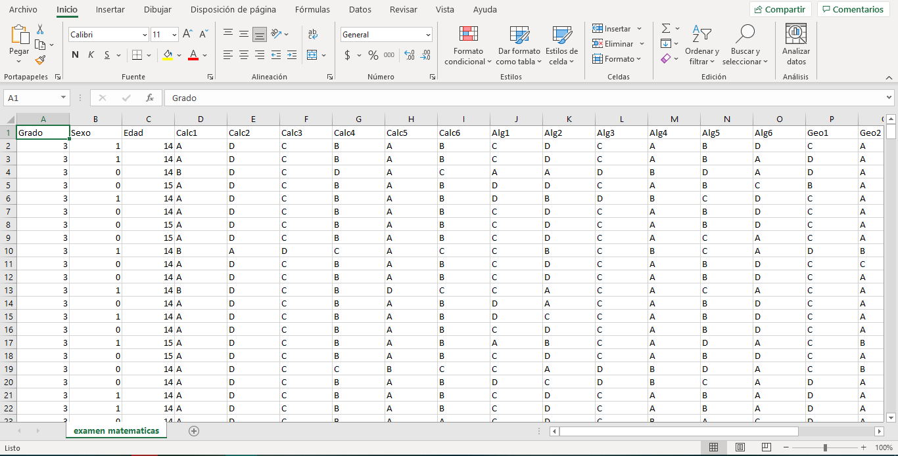

# ¿CÓMO EJECUTAMOS LOS ANÁLISIS ESTADÍSTICOS? {#COMP6}

<center>{width=60%}</center>


```{r setup, include=FALSE}
knitr::opts_chunk$set(echo = TRUE)
```


En esta sección presentaremos herramientas para llevar a cabo el análisis estadístico de los reactivos y de la prueba en general. Para ayudar a que cualquier persona que lea el manual pueda llevar a cabo estos análisis, utilizaremos el lenguaje de programación R. Pese a que llamarlo lenguaje de programación puede resultar intimidante, trataremos de presentar todo el contenido de esta sección de la manera más simple y didáctica posible, de tal forma que el lector solo tenga que reemplazar uno o dos valores que nosotros indicaremos, y que con eso sea suficiente para obtener los resultados deseados. 

Para lograr este cometido, necesitaremos dos prerrequisitos importantes, el primero de ellos es tener instalado R y RStudio; para ello, recomendamos dirigirse a [este enlace](https://gonzalezgouveia.com/como-instalar-rstudio-en-windows-10/) con instrucciones para su instalación:


El segundo requisito es tener una [base de datos](#base) [limpia](#base-limpia) y [ordenada](#base-ordenada) que permita analizar la información de la manera más simple posible. Para ello, recomendamos al lector dirigirse a la siguiente sección y seguir cada uno de los tips presentados ahí.


##	¿Cómo capturamos nuestros datos?

Una base de datos ordenada es aquella en la que cada fila representa a un solo sustentante y cada columna representa un atributo medido de ese sustentante. La primera fila ha de contener el nombre de dichos atributos, y las filas subsecuentes contendrán el valor de ese atributo para cada sustentante sin que existan duplicaciones de información. 

Cuando hablamos de una base de datos limpia, nos referimos a que cada celda de esta contenga información útil, correcta e interpretable. En particular hay algunos puntos que se necesitan para lograr esto:

* **Nombres de las columnas:** Cada columna debe tener un descriptor breve y explicativo. Es sumamente recomendable utilizar una única palabra o abreviatura para describir cada columna. Es importante que usemos descriptores claros, si decido llamara a la columna de “Licenciatura de Procedencia” como “licproc”, probablemente resulte confuso para una segunda persona que lea la base de datos; una mejor opción podría ser “lic_procedencia”. Nótese que se utiliza un “_” para separar las palabras, esto será importante para los subsecuentes análisis. 

* **Codificación de valores:** Cuando hacemos análisis estadísticos, la mayoría de los programas funcionan mejor si utilizamos números para todos nuestros valores. Por ello, es importante que todos los atributos capturados de los sustentantes sean capturados con números (o convertidos en caso de que ya tengamos la base de datos hecha). Por ejemplo, el atributo de sexo puede ser convertido asignando el número 0 para todos los sustentantes que sean hombres y el número 1 para todas las sustentantes que sean mujeres. En este caso, los números 0 y 1 no significan que un sexo sea superior a otro, simplemente son las etiquetas que se dan para distinguirlos. 


:::nota
**Nota:**
Es muy importante que mantengamos un registro por separado de lo que cada código significa. Esto puede hacerse en una segunda hoja de cálculo o en algún documento de texto que guardemos junto a la base de datos.
:::

* **Secuencia de las columnas:** Es recomendable que introduzcamos cada atributo del sustentante en un orden lógico. De igual forma, se recomienda que las columnas iniciales contengan los datos de identificación o demográficos. La primera columna suele ser el identificador del sustentante, ya sea su nombre, clave única o clave asignada. Posterior a esto, se introducen los demás atributos como el sexo, edad, semestre que cursa, etc. En cuanto a los reactivos, es importante que se registren en orden: si tenemos 15 reactivos de un subdominio específico, que esos 15 reactivos se registren en 15 columnas consecutivas.

### La base de datos que utilizaremos

Para este ejemplo, se diseñó una base de datos ficticia de un examen de matemáticas que cubre tres áreas principales: Álgebra, Geometría y Cálculo. Cada área tiene 6 reactivos, siendo que el primer reactivo de Álgebra aparece como `Alg1`, el primero de Geometría como `Geo1`, y el primero de Cálculo como `Calc1`, y todos los demás con la misma clave y únicamente variando en el número final. Además de esto, se elaboró de forma ficticia variables descriptivas como sexo, grado escolar y edad. 

En un archivo de excel, siguiendo las recomendaciones anteriores, nuestra base de datos se vería así:

<center></center>

## ¿Cómo cargamos nuestros datos en R?

Lo primero que tenemos que hacer es abrir RStudio e instalar los paquetes que vamos a requerir para elaborar nuestros análisis. A continuación se presenta el código necesario a ejecutar. La primera vez será necesario ejecutar todo el código, incluidos los comandos "install.packages". En las ocasiones siguientes, una vez que se han instalado los paquetes, solamente será necesario correr la segunda mitad con los comandos "library"

````{r instalar-librerias, eval=FALSE}
# Instalar paquetes
install.packages("psych")
install.packages("psy")
install.packages("sjPlot")
install.packages("lavaan")
install.packages("difR")
install.packages("mirt")
install.packages("pander")
install.packages("kableExtra")
install.packages("corrplot")
install.packages("ShinyItemAnalysis")
install.packages("ltm")
install.packages("lme4")
install.packages("tidyverse")


````

```{r cargar-librerias, message=FALSE, warning=FALSE}
#Cargar paquetes

library(psych)
library(psy)
library(sjPlot)
library(lavaan)
library(difR)
library(mirt)
library(pander)
library(kableExtra)
library(corrplot)
library(ShinyItemAnalysis)
library(ltm)
library(lme4)
library(tidyverse)
```

El primer paso es leer la base de datos que utilizaremos. Es recomendable convertirla a formato "csv" y moverla a la carpeta donde creémos el proyecto. Una vez que lo hemos hecho, podemos ejecutar la siguiente línea, reemplazando lo que está entre comillas  después de `~/` por el nombre de nuestro archivo para la base de datos

```{r base_datos}
datos_completos <- read.csv("~/examen matematicas.csv")


```

Lo que aparece al inicio del código `datos completos` es el nombre que tendrá la variable dentro del ambiente de trabajo de R, este nombre es nuestra sugerencia, pero siempre puede tomar cualquier otro valor, siempre y cuando seamos consistentes al utilizarlo igual en las siguientes funciones. 

### ¿Cómo capturamos la clave de respuestas?

Si nuestra base de datos viene con las repuestas directas que los sustentantes dieron al examen, es decir, aprece qué opción de respuesta seleccionó en cada reactivo (e.g. "A", "B" o "C"), es necesario que capturemos en R cuál es la respuesta correcta para cada uno de los reactivos. Para ello, bastará que usemos la siguiente línea de código, sustituyendo cada uno de los valores dentro de `c()` que se encuentran entre comillas por el valor correspondiente para la respuesta correcta de los reactivos de nuestro examen. Se presentan las opciones en el orden en que esté cada reactivo en la base de datos; es decir, si el primer reactivo tiene como respuesta correcta la A, el primer valor dentro de `c()`, deberá ser "A", si el segundo reactivo tiene como respuesta correcta D, el segundo valor dentro de `c()` será "D", y así sucesivamente. Es importante que utilicemos la misma codificación que en la base de datos. Por ejemplo, si nuestra base de datos tiene "a" en lugar de "A", tenemos que respetar ese formato para que el código funcione. 

En este ejemplo, dado que son 18 reactivos, podemos observar que tenemos 18 letras entre comillas y separadas por comas. Es muy importante que verifiquemos esta información, dado que cualquier error aunque sea en una sola de estas opciones, invalidará todas nuestras posibles interpretaciones de los resultados.


Este paso es necesario únicamente si nuestra base de datos viene con las opciones de respuesta codificadas así, si nuestra base de datos viene directamente con unos y ceros, podemos saltar este paso.

```{r cadena_respuesta}

cadena_respuestas <- c("A","D","C","B","A","B","C", "D","C","A","B","D", "C", "A", "B", "A","D", "C")

```

:::nota
**Nota**
En este caso decidimos nombrar la variable como "cadena_respuestas" dado el tipo de formato que es en R. Mantener los nombres que hemos sugerido, permitirá que sea más sencillo ejecutar todo el código con muy ligeras modificaciones y evitar errores, pero se recalca nuevamente que siempre es posible cambiar los nombres de las variables.
:::

### Seleccionar solamente los reactivos y transformarlos

Ahora, vamos a seleccionar de nuestra base de datos únicamente los reactivos y los convertiremos en una variable diferente. Dentro del componente "select" pondremos el nombre del primer reactivo que aparezca en la base de datos, seguido de este, pondremos dos puntos `:` y después el nombre del último reactivo de la base de datos.

:::nota
Esta es la razón por la que es importante acomodar los reactivos en orden y todos seguidos
:::

```{r seleccion-reactivos}
reactivos_correctos <- datos_completos%>%
  select(Calc1:Geo6)

```

:::nota
Si ponemos atención, el código utiliza el valor de "datos_completos". Este es el primer ejemplo en el que comenzamos a utilizar las variables que ya hemos definido antes, por esto es que es muy importante mantener las consistencias con los nombres, ya que si en esta línea cambiamos aunque sea una letra, R ya no podrá encontrar las variables que definimos previamente y nos dará un error
::::

Con la siguiente linea convertiremos los valores "A", "B", "C" y "D" en respuestas correctas utilizando la clave que generamos con anterioridad. Esto nos permitirá tener una base de datos que puede ser analizada con algunas de las técnicas que veremos a continuación.

```{r convertir-num}
reactivos_correctos[] <- +t(t(reactivos_correctos) == cadena_respuestas)
```

Si ejecutamos la siguiente línea de código, podremos visualizar cómo se ven ahora las primeras observaciones de nuestra base de datos que solamente contiene reactivos y que se ha convertido en unos y ceros.

```{r visualizar-datos}
head(reactivos_correctos)
```


## Desempeño de los reactivos

Ya que tenemos esta base de datos, podemos realizar algunos análisis para ver cómo se comportan los reactivos. Si recordamos lo revisado en la sección del desempeño de los reactivos, los principales análisis que podemos hacer en este campo son:

* TCT
 + [Índice de Dificultad]
 + [Índice de Discriminación]
 + [Correlación reactivo-total]
 + [Alfa si se elimina el reactivo]

* TRI
 + Índice de Dificultad
 + Índice de Discriminación

Para mayor practicidad, sugerimos al lector ejecutar todas las siguientes líneas de código tal como están, con lo que obtendrá como resultado final una tabla con todos estos estadísticos. La interpretación de estos estadísticos se especificó en el capítulo referente los [tipos de análisis que podemos realizar](#COMP5).


```{r tabla-reactivos, message=FALSE, warning=FALSE}
#Tabla inicial con dificultad y discriminación
tabla_items<-ItemAnalysis(reactivos_correctos)
#Modelo de 2 Parámetros IRT del examen de redaccion 
modelo2PL <- mirt(data=reactivos_correctos,model = 1, itemtype="2PL", SE=TRUE, verbose=FALSE)
coef.2PL <- coef(modelo2PL, IRTpars=TRUE, simplify=TRUE)
items.2PL <- as.data.frame(coef.2PL$items)

#Creación de la tabla final
propiedades_items<-bind_cols(tabla_items[,c(1,10,12,15)], items.2PL[,1:2])%>%
  rename(c ("Dificultad" = "Difficulty" , 
          "Discriminación" = "ULI",
        "Alfa si se elimina" = "Alpha.drop", "Correlación con Total" = "RIR"
        ,"Discriminación TRI" = "a", "Dificultad TRI" = "b"))
#Presentación de la tabla final
  kbl(propiedades_items)%>%
  kable_paper("hover", full_width = F)
  
```

## Análisis de los distractores

El lector recordará que también sugerimos incluir el análisis de los distractores. La manera más práctica de hacerlo es al visualizar la frecuencia con la que cada una de las opciones de respuestas fue seleccionada. Si deseamos ver estas frecuencias en forma de tabla y separados por grupos bajo, medio y alto (en las tablas aparecen como 1, 2 y 3 respectivamente), el siguiente comando puede ayudarnos a lograrlo.

:::nota
**Nota**
En este caso, lo que nosotros ejecutaremos serán las primeras líneas hasta `print(distractores)`. Lo siguiente es el resultado de estas líneas para nuestro ejemplo. Simplemente R lo muestra junto a las líneas para mayor practicidad. Como regla general, todo lo que veamos en los cuadros de código que comience con `##` es el resultado que R nos da, y no son líneas que debamos ejecutar.
:::

```{r distractores}
distractores<-datos_completos%>%
  select(names(reactivos_correctos))%>%
  DistractorAnalysis(key = cadena_respuestas, p.table=TRUE)

print(distractores)

```

También podemos presentar únicamente la tabla más estilizada de cualquiera de los reactivos con el siguiente comando, solamente tenemos que reemplazar el número entre corchetes por el número correspondiente al reactivo de nuestro interés

```{r distractores-1}
kbl(distractores[[1]])%>%
  kable_paper("hover", full_width = F)
```


Si identificamos algún reactivo que nos llame la atención por el comportamiento de sus distractores, podemos analizarlo gráficamente con el siguiente comando: 

```{r grafico-distractores}

datos_completos%>%
  select(names(reactivos_correctos))%>%
  plotDistractorAnalysis(key = cadena_respuestas, item=4, item.name= "Cálculo 4")

```


Si queremos ver la correlación de los distractores con el puntaje total, lo podemos hacer con el siguiente comando

```{r -cor-total}

reactivos_completos <- datos_completos%>%
  select(colnames(reactivos_correctos))

examen1<-reactivos_completos %>%
  mutate(row = row_number()) %>%
  pivot_longer(cols = -row) %>%
  mutate(val = 1) %>% 
  group_by(row) %>%
  complete(name, value, fill = list(val = 0)) %>%
  arrange(name, value) %>%
  pivot_wider(names_from = c(name, value), values_from = val, 
              names_sep = '.', values_fill = 0) %>%
  ungroup %>%
  arrange(row) %>%
  select(-row)

examen1 <- examen1%>%
  mutate(Total = rowSums(reactivos_correctos, na.rm = TRUE))


correl1 <- cor(examen1)
cor<- as.vector(correl1[ncol(examen1),1:ncol(examen1)-1])
cor_total <- as.data.frame(matrix(cor, nrow = 4))%>%
  setNames(colnames(reactivos_correctos))%>%
  t()

kbl((cor_total))  %>%
  kable_classic() %>%
  add_header_above(c(""," A", " B", " C", " D"))

```


## Dimensionalidad

La siguiente sección es referente al análisis de dimensionalidad de nuestro instrumento, para llevar esto a cabo, recordemos que contamos con dos estrategias principales: Análisis Factorial Exploratorio y Análisis Factorial Confirmatorio.

### Análisis Factorial Exploratorio

Para realizar el AFE, necesitamos seguir una serie de pasos que presentaremos a continuación. Un primer paso importante es explorar cómo se relacionan los reactivos de nuestro examen. Para hacerlo, es más sencillo analizarlo de manera gráfica. Si ejecutamos el siguiente comando podremos visualizar la relación entre cada uno de los reactivos. Se trata de una matriz de correlaciones, en la que se cruzan los valores de los reactivos de manera horizontal y vertical. En el ejemplo, donde vemos el cruce del reactivo Calc1 y Calc2, se señala la relación que existe entre ambos reactivos. Esta gráfica, en lugar de presentar los valores, presenta un color específico que denota la intensidad de la relación entre ambos, lo cual se ve explicado en la barra lateral derecha.

```{r corplot}
corrplot(cor(reactivos_correctos), method = "circle", na.rm=T, sig.level = 0.05)

```

En este gráfico, ya podemos comenzar a ver qué tanto se relacionan los reactivos entre sí, y nos dará pistas para comenzar a identificar posibles factores, entendidos como los posibles grupos de reactivos que se relacionan más entre sí. 

El siguiente pasó a revisar será ver qué tan factible es llevar a cabo un AFE de acuerdo con la variabilidad de nuestra muestra y con las correlaciones de nuestros reactivos. En esencia, los dos valores que obtendremos al correr las siguientes líneas de código, nos dirán si nuestra muestra tiene suficiente variabilidad en los puntajes y los reactivos tienen una relación lo suficientemente significativa como para llevar a cabo un AFE.

```{r kmo-bartlett}
cortest.bartlett(reactivos_correctos)
KMO(reactivos_correctos)

```

La Prueba de Bartlett es una prueba de significancia, por lo que esperamos que el valor de p `p.value` sea menor a 0.05. Cualquier valor mayor a esto nos indicaría que no es pertinente elaborar un AFE.

El análisis de KMO, arroja valores de 0 a 1, siendo los valores más cercanos a 1 los que nos indican una mayor adecuación de nuestros datos para la ejecución de un AFE. El criterio de definición suele ser 0.8. Es decir, esperamos que nuestros reactivos presenten un KMO mayor a 0.8 para poder identificar que es viable incluirlos en el AFE.


El siguiente paso es determinar el número de factores que vamos a extraer del AFE. Para ello, ejecutaremos la siguiente función que nos mostrará una aproximación de la cantidad ideal de factores a extraer.

Este comando nos dirá directamente la cantidad de factores a extraer, y a su vez, nos presentará un gráfico en el que se puede observar la mejoría en la varianza explicada en relación con el aumento de factores. Es decir, hacia la derecha, cada punto representa la cantidad de factores, y se puede ver qué tanta varianza explica cada uno de los factores. Como se puede ver, cada factor que se añade explica menos cantidad de varianza, por lo que es importante determinar en qué punto la cantidad de varianza que explica la inclusión de un nuevo factor es tan insignificante que no resulta necesario incluir ese factor.

El gráfico nos ayuda a determinarlo al trazar la línea roja punteada, en este ejemplo podemos ver que el factor que ya no añade suficiente varianza es el 5, y por ello es que el análisis recomienda 4 factores.

```{r parallel}
fa.parallel(reactivos_correctos, fm = "uls", fa = "fa")
```


Una segunda opción es el análisis vss, que realiza un procedimiento similar mediante otros métodos, lo cual nos sirve como una segunda opinión o método a considerar para decidir la cantidad de factores. Este análisis nos dará varios criterios referentes a la cantidad ideal de factores, por ejemplo, presenta en primer lugar el `VSS complexity 1`, y nos indica la cantidad de factores que ofrece un mejor resultado.
Otro criterio que se suele tomar en cuenta es el `Velicer MAP` o el "BIC". Idealmente, todos estos criterios deberían mostrar la misma cantidad de factores, pero cuando no es así, dependerá de nosotros seleccionar los criterios que consideremos más adecuados según nuestro caso particular.De igual forma, será necesario que respaldemos la decisión del número de factores con evidencia.

```{r vss}
vss(reactivos_correctos)

```

El análisis VSS recomienda un solo factor, probablemente debido a que todos los reactivos son referentes a matemáticas. Sin embargo, el MAP recomienda dos factores, y el BIC recomienda tres. De manera interesante, ninguno de los valores del análisis VSS recomienda cuatro factores como el anterior. 

Debido a que nosotros estimamos que contamos con tres factores dado que así se construyó el examen, y el criterio BIC respalda esa decisión, haremos los análisis con estos tres factores. Sin embargo, cabe aclarar que las discrepancias entre estos métodos nos pueden estar indicando que la estructura de nuestro examen es ambigua.


Una vez que hemos determinado la cantidad de factores, podemos pasar a ejecutar el siguiente código para obtener el AFE. El aspecto principal que tenemos que tomar en cuenta es la rotación. Este es un concepto con bases matemáticas, que en esencia se refiere a la forma en que el análisis puede determinar las cargas factoriales. Existen dos tipos principales, las ortogonales y las oblicuas. En las primeras se asume que los factores que obtengamos no se relacionan entre sí, mientras que en las segundas, esto sí es permitido. Dentro de las ortogonales la más utilizada es la "varimax", mientras que entre las oblicuas la más utilizada es la "oblimin". En este caso, decidimos utilizar "promax", que es un método con la rigurosidad de varimax pero que permite la relación entre los factores en un segundo paso. 

:::nota
**Nota:**
Si al lector le interesa profundizar en esto, recomendamos consultar el artículo de @lloret2014, el cuál presenta una guía práctica para la elaboración de AFE en español.
:::


```{r afe}
AFE <- factanal(reactivos_correctos, 3, rotation="promax")
print(AFE$loadings, digits=2, cutoff=.3, sort=TRUE)

```

Podemos observar que en las filas se enlistan todos los reactivos, y en las columnas los 4 factores que obtuvimos en este caso. El valor que se muestra en cada cruce de ambos es la carga factorial de ese reactivo en ese factor dado.

#### Interpretación

Lo que esperamos en este caso es que cada reactivo tenga una carga significativa en uno solo de los factores. Por lo general, si observamos que un reactivo se agrupa en dos factores, esto es un indicador de que dicho reactivo está midiendo dos cosas a la vez, lo cual no es algo que estemos buscando.  Será importante también evaluar el valor que presente cada reactivo en la carga factorial (el valor que aparece en el cruce entre el reactivo y el factor). Algunos autores señalan como criterio para definir si el reactivo se agrupa en el factor correspondiente, que la carga factorial sea mayor a .4. De igual forma, si un reactivo carga en dos factores, podemos decantarnos por darle prioridad al factor en el que tenga una carga factorial más alta, de preferencia, si la diferencia entre ambas cargas factoriales es mayor a .2.

Es importante destacar que habrá ocasiones en las que algunos reactivos no tengan una carga significativa en ningún factor, o que carguen de manera muy similar en dos factores distintos. En estos casos, esto ya es un indicio de que el reactivo no se está comportando como esperaríamos, sin embargo, podemos intentar utilizar otros métodos de rotación para ver cuál funciona mejor con nuestros datos y si existe mejoría con estos reactivos. Tal como hemos venido mencionando, para eliminar un reactivo, debemos tomar en cuenta toda la evidencia en su conjunto, y no solamente la correspondiente a un solo análisis, como en este caso.

Una vez que hemos identificado las cargas factoriales y agrupado cada reactivo en un solo factor, es momento de identificar qué representa cada uno de estos factores con base en los reactivos que se agruparon en ellos. En el ejemplo de arriba, los reactivos se agruparon de la manera que se esperaba, todos los de Cálculo juntos, todos los de Algebra también y lo mismo para los de Geometría, por lo que podemos definir que esos tres son los factores que encontramos. Sin embargo, no siempre será así, en ocasiones, es posible que reactivos que contemplamos medían una cosa, se agrupen en un factor distinto, por lo que sería importante revisar dicho reactivo y considerar si de verdad está midiendo lo que esperábamos que midiera. En ocasiones, al observar la agrupación de los reactivos, y basados en nuestra revisión bibliográfica, podemos determinar que esos reactivos agrupados en un factor, en realidad están midiendo un constructo distinto. Pero para esto, hace falta un procedimiento sumamente riguroso, sistemático y basado en evidencias, tanto del AFE como de la literatura.


### Análisis Factorial Confirmatorio 

Para llevar a cabo el análisis factorial confirmatorio, como ya se mencionó, nosotros definimos el modelo que queremos poner a prueba. Para lograrlo, utilizamos la sintaxis que se presenta en el cuadro de código siguiente. 

```{r modelo-afc}


modelo <- ' 
Calculo=~  Calc1 + Calc2 + Calc3 + Calc4 + Calc5 + Calc6 
Algebra=~  Alg1 + Alg2 + Alg3 + Alg4 + Alg5 + Alg6 
Geometria=~  Geo1 + Geo2 + Geo3 + Geo4 + Geo5 + Geo6 
'

```

Lo primero que hacemos es ponerle un nombre a nuestro modelo, dado que en este ejemplo no haremos comparación de modelos, simplemente llamamos al que presentamos "modelo". Si el lector tuviera que comparar distintos modelos, sería importante nombrar a cada uno de manera sencilla y que permita identificarlos fácilmente. Después de nombrarlo, utilizamos el signo de asignación en R `<-` y abrimos comillas simples. La sintaxis dentro del espacio de comillas es muy simple. Primero definimos la variable latente, es decir, aquello que suponemos que nuestros reactivos están midiendo. En el ejemplo que estamos utilizando, todos los reactivos que comienzan con "Calc", fueron diseñados pensando en que midieran Cálculo, por lo que podemos llamar a ese factor así. Una vez definido el nombre del factor, se incluye el símbolo `=~` que nos indica que ese factor está compuesto por lo que sigue. Por ello, después de ese signo, se enlistan todos los reactivos que se incluyen en dicho factor, separados cada uno por un signo de `+`. Después del último reactivo, iniciamos en una nueva línea y repetimos el mismo proceso para cada factor, y al terminar simplemente cerramos las comillas simples.

:::nota
Es importante destacar que los reactivos dentro del modelo deben tener exactamente el mismo nombre que tienen como variables dentro de nuestra base de datos.
:::

Una vez definido el modelo, solamente tenemos que ejecutar las siguientes líneas de código para obtener el resumen de los resultados de dicho modelo en nuestra muestra. Solamente necesitamos poner dentro de la función "afc" el nombre de nuestro modelo, el nombre de la base de datos con nuestros reactivos y elegir el método de estimación de parámetros con el indicador `estimator =`. Para el contexto de exámenes con una sola respuesta correcta por reactivo, algunos autores recomiendan utilizar el método "ULS" por lo que es el que dejamos por defecto en esta línea de código, pero existen otras opciones como los métodos de Máxima Verosimilitud o los de WLS.


El resultado de estas líneas de código será un resumen amplio de cómo se comporta el modelo, mostrando las cargas factoriales de cada reactivo y algunos otros estadísticos. Sin embargo, para fines prácticos de este manual, nos concentraremos en los resultados ofrecidos por la última línea de código, la cual nos muestra una serie de índices de bondad de ajuste del modelo.


```{r afc}

ajuste <- cfa(modelo, data=reactivos_correctos ,std.lv= TRUE, estimator = "ULS", 
              auto.fix.first = FALSE, sample.nobs=417)
#Resultados de dicho modelo
summary(ajuste,fit.measures=T,standardized=T)

fitmeasures(object = ajuste,fit.measures = c("chisq","df","cfi","tli","rmsea",
                                            "rmsea.ci.upper","rmsea.ci.lower"))

```

Los índices de bondad de ajuste más utilizados suelen ser dos: el "CFI" y el "RMSEA". Existen variaciones de ambos e índices similares, pero para fines prácticos, en este manual nos concentraremos en esos dos. El CFI es un índice de la bondad de ajuste, que en esencia nos dice qué tan bien se ajustaron los datos al modelo propuesto; es decir, qué tanto los datos que tenemos de nuestra muestra realmente se están comportando como el modelo predice en términos de que los reactivos sí se agrupen como nosotros definimos que lo harían. EL CFI es un estadístico que toma valores de 0 a 1, siendo los valores más cercanos a 1 indicadores de un buen nivel de ajuste. Algunos autores suelen definir como criterio de decisión un valor mínimo de .90 para indicar un buen ajuste y un valor de .96 para indicar un ajuste excelente. 
Por su parte, el RMSEA, es una medida del error presente en el modelo, nos indica los residuales de aquello que el modelo no fue capaz de explicar de nuestros datos. Por ello, lo que esperamos es obtener un valor muy pequeño de este estadístico. En específico, algunos autores recomiendan como criterio de decisión valores menores a .06 como índice de un buen ajuste.


## Confiabilidad

Como se mencionó en el [capítulo anterior](#COMP5), existen diversos tipos de confiabilidad, los cuales se obtienen con diferentes métodos. Sin embargo, la más usada usualmente, debido a su practicidad es la confiabilidad de consistencia interna, en especial el coeficiente Alfa de Cronbach. Para obtenerlo, solamente tenemos que utilizar la función `cronbach()` e indicar dentro de esta el nombre de la base de datos en donde se encuentran únicamente nuestros reactivos.

```{r alfa-1}
cronbach(reactivos_correctos)

```

Este comando nos arroja tres valores específicos; aunque los primeros dos ya los conocemos (el tamaño de la muestra y el numero de reactivos), es importante verificar que están correctamente capturados. Una vez que lo hemos revisado, el dato que nos importa es el coeficiente Alfa que aparece en el último renglón. Recordaremos que este valor puede ir de 0 a 1, y los valores más cercanos a 1 suelen indicar una mejor confiabilidad. 

```{r alfa-2}
cronbach(reactivos_correctos)

```

Ahora bien, hasta aquí hemos omitido aclarar un punto de suma importancia en este análisis. Recordemos que en el apartado anterior llevamos a cabo el análisis de la dimensionalidad, en el que pudimos comprobar si nuestro examen presenta las dimensiones que presuponíamos desde un inicio. Si obtuvimos un examen multidimensional, como en el ejemplo que hemos utilizado aquí, es importante que analicemos la confiabilidad de cada una de las dimensiones. Dado que los reactivos se agrupan de esa forma, nosotros interpretamos que se agrupan así porque miden un mismo constructo en cada dimensión y por lo tanto, tendríamos que obtener puntajes de cada dimensión; es decir, si nuestro examen presenta varias dimensiones, tenemos que interpretar cada dimensión por separado, obteniendo un puntaje total para cada una con su respectivo coeficiente de confiabilidad.


Para obtener este coeficiente de confiabilidad, simplemente tenemos que generar una base de datos para cada dimensión que contenga exclusivamente los reactivos correspondientes. En las siguientes líneas de código presentamos un ejemplo de ello. Al igual que cuando generamos la base de datos total, aquí solamente tenemos que poner el nombre del primer reactivo de la dimensión seguido de `:` y el nombre del último reactivo de la dimensión, todo esto dentro de la función `select()`. Ya que lo hemos hecho, simplemente ejecutamos nuevamente la línea "cronbach()" con el nombre de nuestra nueva base de datos.

```{r alfa-3}
calculo <- reactivos_correctos%>%
  select(Calc1:Calc6)

cronbach(calculo)
```

Si queremos interpretar la suma de las distintas dimensiones como un puntaje total, necesitamos aportar evidencia de que esta interpretación es válida. Ya sea por evidencia obtenida en la revisión para el marco conceptual o por estudios estadísticos, debemos presentar evidencia de que es posible utilizar la suma de cada dimensión como un puntaje significativo e interpretable. 

En caso de que nuestro examen presente una sola dimensión, podemos simplemente proceder con la primer línea de código referente al Alfa de Cronbach general.

Como mencionamos en el componente 5, otra opción es el uso del coeficiente Omega, el cuál nos brinda el análisis de confiabilidad basado en la estructura de dimensionalidad que obtuvimos en el AFC, con los siguientes comandos podemos obtener los coeficiente de omega de cada dimensión.


```{r omega}
omega<-omegaFromSem(ajuste)

omega$omega.group$total
```


## Imparcialidad

Para poder presentar evidencia de que el examen no da ventaja a ningún grupo en específico, podríamos comenzar con un análisis de varianza (ANOVA). Este análisis, nos permite identificar si existen diferencias en los promedios de puntaje total del examen entre los grupos que queramos evaluar. De hecho, un primer paso para llevar a cabo este análisis es visualizar gráficamente cómo se distribuyen los puntajes por grupos. Para ello, podemos utilizar las siguientes líneas de código:

```{r dif-1}
datos_completos <- datos_completos%>%
  mutate(across(-names(reactivos_correctos), factor))

reactivos_total <- datos_completos%>%
  mutate(Total = rowSums(reactivos_correctos))

reactivos_total%>%
  ggplot(aes(x = Sexo, y = Total, col = Sexo)) + geom_boxplot() +
   scale_x_discrete(labels = c("Mujeres", "Hombres"))

```

Como podemos observar, en este ejemplo, no parecen existir diferencias significativas entre ambos grupos. La línea gruesa que vemos atraviesa de forma horizontal la gráfica es la media de cada grupo, y la caja como tal es una manera gráfica de representar cómo se distribuyen aproximadamente los puntajes de los evaluados. Pese a que en cuanto a las medias no parece haber diferencias, pareciera haber mayor proporción de puntajes bajos en los hombres, así que sería importante también hacer el análisis de varianza. Podemos hacerlo con las siguientes líneas de código:

```{r anova}
anova_genero<-aov(Total ~ Sexo, data= reactivos_total)
pander(anova_genero)

```

La información que más nos interesa es la última columna que aparece como `Pr(>F)`. Este valor es la significancia, y nos dirá si las posibles diferencias observadas entre ambos grupos son estadísticamente significativas. En educación y en ciencias sociales, el criterio de decisión lo solemos establecer en .05. Es decir, si el valor de esta columna es menor .05, podemos decir que las diferencias son significativas; en caso contrario, podemos decir que no existen diferencias entre ambos grupos. 

En este ejemplo, no parece haber diferencias significativas en el total. Sin embargo, esto no nos garantiza que el examen y los reactivos estén siendo imparciales. **(ver nota).** Para evaluar de manera más profunda y precisa la presencia de sesgos que atenten contra la imparcialidad, la herramienta más utilizada en este contexto es el Análisis del Funcionamiento Diferencial del Reactivo (DIF por sus siglas en inglés).

:::nota
Inclusive, aunque hayan existido diferencias significativas entre los grupos, eso no significa que esas diferencias sean debidas a que el examen está sesgado. De hecho, como se mencionó en el capítulo anterior, al igual que en el siguiente análisis, estas diferencias podrían ser explicadas por diferencias existentes reales entre ambos grupos. 
:::

El análisis DIF nos indica la presencia de sesgos en los reactivos que favorezcan más a algún grupo con respecto a otro independientemente de su nivel de habilidad. Esto es, si dos sustentantes tienen el mismo nivel de habilidad, pero uno de ellos por pertenecer a un grupo distinto tiene mayor probabilidad de contestar de manera correcta dicho reactivo. 

:::nota
**Nota**
Existen muchos métodos distintos para detectar la presencia de DIF en cada reactivo, algunos que parten de la IRT y algunos que parten de otras teorías. Para fines prácticos, en este análisis incluiremos la comparativa de dos modelos de manera simplificada, pero si al lector le interesa profundizar en este aspecto, recomendamos revisar el capítulo de @penfield2006.
:::

Para llevar a cabo el análisis, simplemente tenemos que ejecutar la siguiente línea de código. En el campo de Data, pondremos el nombre de nuestra base de datos que solamente incluye los reactivos en formato de 0-1. En el campo de group, incluiremos la variable que define los grupos que queremos contrastar; en este caso, haremos el análisis en términos de género. Recordaremos, que esa variable estaba presente en la primera base de datos que cargamos en nuestro ejemplo, por lo que podemos referenciarla poniendo el nombre de la base de datos donde se encuentra seguido del signo "$" y el nombre de la varible.

El último componente que debemos específicar es el grupo focal. Para definir esto, es importante que tomemos en consideración cuál es el grupo que consideramos parte con desventaja. Esto puede estar basado en experiencias previas, en revisión de la literatura, o inclusive, en los análisis aquí realizados. Como podemos ver en el gráfico de cajas, pese a que no existen diferencias significativas, los hombres presentan una mayor distribución en puntajes bajos, así que, para fines didácticos, podemos asumir que son los hombres quienes parten con desventaja. El valor que ponemos en este caso es 1, que recordaremos es el que asignamos en un inicio a los hombres.

```{r MH}
MH<- difMH(Data=reactivos_correctos, group=datos_completos$Sexo, focal.name= 1, purify=TRUE)

MH

```

Este primer análisis se basa en modelos no IRT. Lo que nos interesa es la sección titulada "items detected as DIF items", dado que en ella se presentan específicamente qué reactivos fueron detetados con DIF significatvio. Por otr lado, también nos interesa la tabla que aparece al final, donde se presenta el nombre de cada reactivo seguido por dos datos numéricos y una clasificación de "A, B y C"; dicha clasificación nos indica si la presencia de DIF es insignificativa `A`, moderada `B` o grande `C`. 

Para verificar y contrastar estos resultados, podemos utilizar un modelo más basado en la TRI. Cabe resaltar, que al igual que en los análisis que ya hicimos referentes a la TRI, es importante considerar el tamaño de nuestra muestra, si contamos con una muestra pequeña, recomendamos quedarnos únicamente con el primer análisis.

En este modelo TRI, los campos a especificar son los mismos, el único que se añade es si el modelo de la TRI será de 1 `1PL`, 2 `2PL` o tres parámetros `3PL`. 

```{r Lord}
Lord<- difLord(Data=reactivos_correctos, group=datos_completos$Sexo, focal.name= 1, model="2PL", purify=TRUE)

Lord
```

En este caso, el resultado se presenta al revés, dado que primero aparece la tabla con la significancia del efecto DIF. En este método, en lugar de presentarse con clasificaicón "ABC", se presenta con asteríscos, siendo que los reactivos con presencia de DIF considerable aparecen con un asterísco junto a ellos, si aparecen más de un asterísco, quiere decir que el nivel de significancia del efecto DIF es mayor.

Como podemos ver, utilizar estos dos métodos nos permite contrastar la presencia de DIF en los reactivos, y ver si es consistente en ambos modelos. En este ejemplo, podemos observar que el reactivo 1 de algebra (el reactivo 7 en el orden del total de reactivos) presenta DIF en los dos métodos, por lo que resulta importante indagar más en cuál está siendo su comportamiento. Para ello, una forma útil de hacerlo es analizarlo gráficamente, si corremos el siguiente código, podremos visualizar cómo se comporta la CCI del reactivo para los dos grupos. En la última línea de código, debemos especificar qué reactivo queremos visualizar al definir "item =". En este caso, lo que escribiremos es el número del reactivo en el orden en el que aparecen en nuestra tabla anterior.

```{r grafica-lord}

coefLord<- Lord$itemParInit
plotDIFirt(coefLord, item = 7)
```

 Como podemos ver, en este caso, parecería que el reactivo favorece más a las mujeres en los niveles bajos de habilidad. Es decir, cuando un hombre y una mujer tienen ambos un nivel bajo de habilidad en el constructo medido, la mujer tiene una probabilidad más alta de contestar correctamente el reactivo, mientras que en los niveles altos de habilidad, la probabilidad de contestar correctamente es más similar entre ambos grupos. A esto se le llama DIF no uniforme. 
 
 Una vez que hemos detectado esto, el siguiente paso, como se mencionó en el capitulo anterior, es revisar cualitativamente el reactivo con jueces expertos para poder identificar, si efectivamente hay algo en el reactivo que esté favoereciendo al grupo de las mujeres, o si, por el contrario, se trata de una diferencia específica real entre ambos grupos con respecto a lo que este reactivo evalúa. 
 
 
## Gráficos

Esta última sección corresponde al apartado referente al informe de resultados. Como se mencionó en esa sección, al presentar resultados es de suma utilidad recurrir a recursos gráficos para resumir la información. De hecho, algunos de los gráficos y tablas que ya se generaron en este capítulo pueden ser de gran utilidad para el reporte final, especialmente aquel que incluye el reporte del desempeño de los reactivos y del examen. Pese a ello, existen otros gráficos que pueden ser de utilidad. En este ejemplo, generaremos un par de gráficas esperando que al lector le resulte de utilidad para sus propios informes, si desean conocer más sobre las herramientas gráficas en R y cómo generar otro tipo de gráficas, recomendamos referirse a los siguientes enlaces


El gráfico que generaremos en este ejemplo permitirá observar cómo se distribuyeron los porcentajes de respuestas en nuestra muestra, primero en general, y después dividios por sexo. 


```{r datos-grafica}

datos_graficos <- reactivos_total%>%
  mutate(Sexo = case_when(Sexo == 0 ~ "Hombre", Sexo ==  1 ~ "Mujer"))%>%
  mutate(Porcentaje = round((Total/max(Total))*100))%>%
  mutate(rango_porcentaje = case_when(Porcentaje%in% 1:10 ~ "1-10", Porcentaje %in% 11:20 ~ "11-20",
                                     Porcentaje%in% 21:30 ~ "21-30", Porcentaje%in% 31:40 ~ "31-40",
                                     Porcentaje%in% 41:50 ~ "41-50", Porcentaje%in% 51:60 ~ "51-60",
                                     Porcentaje%in% 61:70 ~ "61-70", Porcentaje%in% 71:80 ~ "71-80",
                                     Porcentaje%in% 81:90 ~ "81-90", Porcentaje%in% 91:100 ~ "91-100"))

```

Lo primero que haremos será modificar nuestra base de datos; en las primeras líneas de código cambiaremos algunas de nuestras variables. Primero, para que al distribuir por sexos aparezcan las etiquetas de "Hombres" y "Mujeres" en lugar de unos y ceros, modificaremos dicha variable. Es importante que ubiquemos qué valor corresponde a Hombres y cuál a mujeres para con ello describirlo correctamente en la línea de código, en este caso, el 0 corresponde a hombres, mientras que el 1 corresponde a mujeres, por lo que se asignan de esa manera.

En las siguientes líneas de código se modifica el puntaje total. Primero se convierte en porcentaje y después se agrupa en frecuencias, ubicando juntos a todos los que tengan puntajes del 1 al 10%, del 11 al 20, y así sucesivamente.

Ya que hemos generado esta nueva base de datos dedicada a los gráficos que vamos a generar, podemos ejecutar la siguiente línea de código para obtener nuestor primer gráfico

```{r grafica-1}

datos_graficos%>%
  ggplot(aes(x = rango_porcentaje)) + geom_bar(fill = "steelblue") +
  labs(title = "Distribución de frecuencias de puntajes totales",
       x = "Puntaje total",
       y = "Frecuencia")


```

El paquete que estamos utilizando para este ejemplo se llama "ggplot2", este paquete tienen un nivel de personalización muy amplio, pero su código es poco comprensible para quien no está familiarizado. En este ejemplo intentaremos concentrarnos en los aspectos fundamentales que nos ayudarán a generar los gráficos específicos que buscamos aquí, si al lector le interesa profundizar en el tema, nuevamente referimos a los enlaces presentados arriba.

:::nota
**Nota**
Si al lector le interesa profundizar en el uso de este tipo de gráficas, una buena herramienta es la presentada en [este enlace](https://www.hebergementwebs.com/tutorial-de-ggplot2/ggplot2-guia-rapida).
:::

En la sintacis, lo primero que definimos es la variable que vamos a presentar. En este primer ejemplo, en lugar de presentar el puntaje total crudo, pasaremos directamente a presentarlo en términos de porcentaje agrupados en categorías de 10 en 10, variable a la cual llamamos arriba "rango_porcentaje".

Posteriormente, definimos qué tipo de gráfico queremos. En este caso es un gráfico de barras que se define con la línea `geom_bar()`. Dentro de ella, podemos definir el color del que queremos las barras. Puede ser un nombre como "steelblue" que se traduce como azul metálico, o puede ser el código html del color que buscamos. Podemos buscar el color específico que queremos y obtener su código html en [esta página](https://htmlcolorcodes.com). En la siguiente gráfica vemos un ejemplo de ello.

```{r grafica-2}

datos_graficos%>%
  ggplot(aes(x = rango_porcentaje)) + geom_bar(fill = "#54CDBA") +
  labs(title = "Distribución de frecuencias de puntajes totales",
       x = "Puntaje total",
       y = "Frecuencia")


```

Después de este comando, añadimos uno más en el que definimos los títulos de la gráfica, tanto el título principal como los de cada eje de la gráfica; lo que está dentro de las comillas puede modificarse por el titulo que deseemos.

En la siguiente gráfica, añadiremosla separación por sexos.

```{r grafica-3}


datos_graficos%>%
  ggplot() + geom_bar(aes(x = rango_porcentaje, fill = Sexo),position=position_dodge()) +
  labs(title = "Distribución de frecuencias de puntajes totales",
       x = "Puntaje total",
       y = "Frecuencia") 

                    
```

Si observamos el código, veremos que modificamos el valor de `fill` por la variable Sexo, esto permitirá que observemos por separado los valores de hombres y mujeres. Además de esto, agregamos la línea "position=position_dodge()", que nos permite ver lado a lado los valores de cada sexo.

Ggplot2 genera en automático dos colores predeterminados, pero al igual que en el caso anterior, podemos personalizar los colores que necesitemos, solo que con una línea de código distinta.

```{r grafico-4}


datos_graficos%>%
  ggplot() + geom_bar(aes(x = rango_porcentaje, fill = Sexo),position=position_dodge()) +
  labs(title = "Distribución de frecuencias de puntajes totales",
       x = "Puntaje total",
       y = "Frecuencia") +
  scale_fill_manual(values = c("#54CDBA", "#BA95DF"))

                    
```

En este caso, añadimos el comando `scale_fill_manual()` y dentro de él especificamos entre comillas cada uno de los valores que queremos.