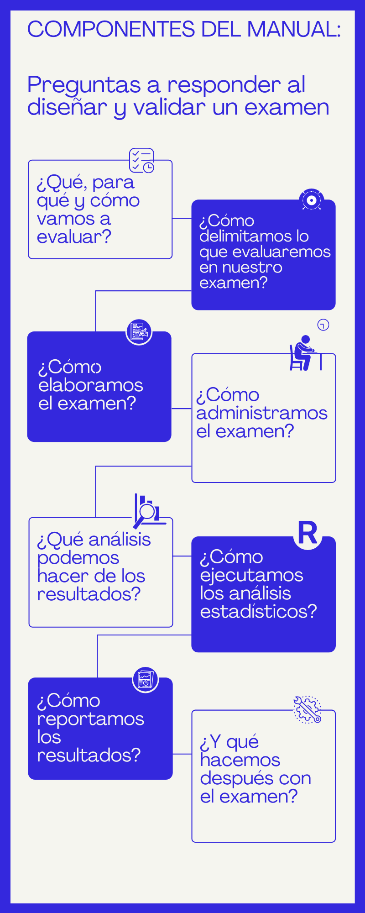

--- 
title: "ASPECTOS ESENCIALES EN AL CONSTRUCCIÓN DE EXAMENES DE OPCIÓN MÚLTIPLE"
author: 
- Davin Eduardo Díaz García
- Elizabeth Vega Gatica
date: "2021-06-14"
site: bookdown::bookdown_site
documentclass: book
bibliography: [book.bib, packages.bib]
biblio-style: apalike-es
link-citations: yes
cover-image: images/LOGO-UNAM.png
description: "Este es un manual técnico en construcción de cómo diseñar, aplicar y validar exámenes de opción múltiple de alto impacto"
---

# ¿Para qué necesitamos revisar un manual técnico? {-#para}

El presente manual está dirigido a comisiones académicas de licenciatura y posgrado, no expertas en evaluación, que se encargan de la elaboración de exámenes de opción múltiple. Busca ser una guía en el proceso de diseño, desarrollo, aplicación, análisis e interpretación de exámenes de alto impacto que pretendan ser usados como herramientas que permitan la toma de decisiones en distintos ámbitos a nivel licenciatura o posgrado.  

Mediante una serie de cuestionamientos y preguntas guía, además de información sintetizada, buscamos que los lectores puedan diseñar, construir y validar los exámenes de acuerdo con sus necesidades y contextos específicos.

Cuando queremos medir aprendizajes, conocimientos, habilidades o desempeños de nuestros alumnos, debemos buscar herramientas que registrarlos u observarlos, por lo que buscamos desarrollar un instrumento que permita realizar afirmaciones sobre el desempeño de los individuos. Pero, desarrollar un instrumento no es tarea fácil, requiere de una serie de pasos y condiciones que ayuden a garantizar la pertinencia, justicia, [confiabilidad](#confiabilidad) y la [validez](#validez-G) de las interpretaciones que se quieran emitir y que tienen un impacto significativo en la vida de los alumnos, por lo que es fundamental desarrollar el instrumento basándonos en las buenas prácticas de evaluación, es decir, en los Estándares para Pruebas Psicológicas y Educativas del American Educational Research Association, American Psychological Association y National Council on Measurement in Education [@AERA2018], las cuales nos ayudarán a evitar perjudicar con los resultados de las pruebas a los alumnos; es decir, el objetivo es lograr la construcción de instrumentos confiables, válidos y justos, es por eso que a continuación se presentan una serie de componentes que nos guiarán en el diseño y desarrollo de instrumentos de medición adecuados basados en los estándares y en evidencias científicas. 

## ¿Cúales son las fases del procedimiento? {-#fases}

Fases del procedimiento:  

## ¿Cómo leer este manual? {-#instructivo}

Como el lector se podrá dar cuenta, el presente manual está constituido por una serie de fases que permitirán el diseño y desarrollo de exámenes de alto impacto; además cada una de las fases cuenta con 5 apartados adicionales, que contienen información de suma importancia, los apartados se verían de la siguiente manera:  

:::evidencia
**Evidencias documentales** 
En este apartado se señalan los productos resultantes de cada fase que servirán para dar evidencias de los procesos o análisis realizados, lo cual permitirá apoyar la validez de las interpretaciones y usos de los resultados. 
:::

:::seguridad
[**Seguridad**](#seguridad-G)
Este es un aspecto transversal en todas las fases de construcción del examen, por lo que en cada fase se hacen explicitas las recomendaciones para el resguardo de la información obtenida. 
:::

:::aera
**Estándares** Dado que el presente manual está basado en los Estándares para Pruebas Psicológicas y Educativas de la @AERA2018, se hacen explícitos algunos de estos estándares que de manera general abordan cada una de las fases. 
:::

:::quiz
**Preguntas** Al finalizar cada fase se plantean uno o más cuestionamientos que permiten al lector reflexionar sobre lo aprendido en dicha fase, e identificar si no se entendió de manera clara algún aspecto del contenido, es decir, sirven como un método de autoevaluación del aprendizaje alcanzado. Las respuestas propuestas a estas preguntas se incluirán en una sección distinta, por si el lector desea consultarlas, pero sí recomendamos que intente responderlas por sí mismo para reforzar el aprendizaje.
:::

:::nota
**Nota**
También se realizan recomendaciones sobre bibliografía de apoyo para profundizar en ciertos aspectos del proceso de evaluación y se hace uso de notas que permiten aclarar determinados puntos especificados en el contenido de las fases.
:::

De igual manera, al ser un manual interactivo, el lector podrá encontrar durante su lectura algunos vínculos que le permiten trasladarse a otro apartado del manual que sea necesario leer según las necesidades y propósitos del examen que se va a desarrollar, así como vínculos que permiten al lector ir directamente al glosario ubicado al final del manual. 

Finalmente, es preciso señalar que, aunque las fases tienen un orden lógico determinado, una recomendación que permitirá al lector darle un uso efectivo y práctico a la información proporcionada por el manual, es realizar una lectura general de todo el manual antes de comenzar a planear, diseñar y desarrollar el instrumento, lo cual permitirá la comprensión de la relación existente entre las diversas fases y por ende facilitará la realización de la primera fase del manual, la cual requiere el planteamiento de los aspectos generales de todo el proceso de diseño y desarrollo del examen, por lo que se necesita entender el proceso de construcción en su totalidad.

Considerando lo anterior, el presente manual usa como referencias principales tres fuentes bibliográficas:  @AERA2018, @INEE2019 y @Lane2016, por lo que las citas que se encuentren dentro del contenido de las fases son fuentes específicas de elementos más especializados, planteadas de acuerdo con los requerimientos de las fases del manual. 
Ahora si estamos listos para comenzar la construcción de nuestro examen. 
