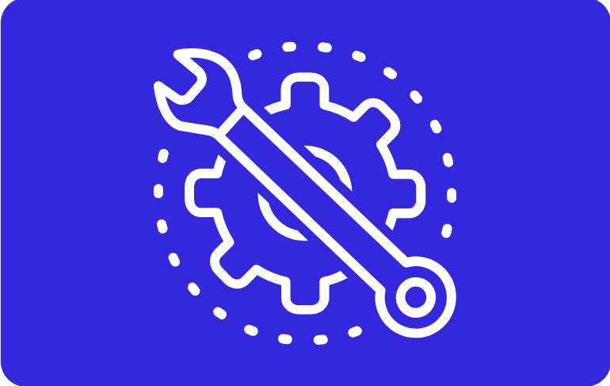

# ¿Y QUÉ HACEMOS DESPUÉS CON EL EXAMEN? {#COMP8}

{width=60%}

Una vez que hemos terminado el proceso de elaboración de nuestro instrumento, lo aplicamos, verificamos sus propiedades métricas y validamos sus usos e interpretaciones, pareciera que el proceso está terminado. Sin embargo, hay una etapa más que suele dejarse de lado, y que, dependiendo del tipo de instrumento que hayamos construido es de suma importancia. Si nos regresamos a las primeras etapas y pensamos en los usos e interpretaciones que definimos para nuestro instrumento, hay que preguntarnos ¿el instrumento fue diseñado para una única aplicación aislada?, ¿o se pretende utilizar en múltiples aplicaciones a lo largo del tiempo? Si se trata más bien de la segunda opción, será importante que demos [mantenimiento](#mantenimiento) a nuestro instrumento.
Cuando hablamos de mantenimiento nos referimos a vigilar que los usos e interpretaciones del instrumento sigan siendo válidos para futuras aplicaciones. Existen algunas áreas específicas que corren riesgo de atentar contra esta validez a lo largo del tiempo, y, que por lo tanto debemos cuidar:

##	Contenido de los reactivos: 
Existen áreas específicas que se actualizan constantemente, por ejemplo, un examen de física o ciencias naturales podrá contener conceptos que dentro de un par de años se vuelvan obsoletos, o que sean remplazados por nuevos conceptos o teorías. En casos como estos, es importante que vigilemos que nuestros reactivos contengan información actualizada.  

##	Seguridad del instrumento: 
En exámenes de alto impacto, como un examen de ingreso a la universidad, es muy importante seguir generando reactivos constantemente. Supongamos que una persona hace el examen y no logra ingresar a la universidad, pero logra recordar o capturar reactivos específicos del examen; si no generamos nuevos reactivos para la siguiente edición, esa persona tendrá mayor probabilidad de ingresar, pero no porque tenga los conocimientos y habilidades, sino porque recuerda los reactivos y tuvo el tiempo de indagar las respuestas correctas.  

##	Desempeño psicométrico: 
Es importante que tengamos en cuenta que la confiabilidad y las evidencias de validez que obtenemos, no son de la prueba en sí, sino de la muestra a la que se le aplicó en específico; por ello, es importante que en cada nueva aplicación vigilemos las propiedades de nuestros reactivos. Supongamos que, de acuerdo a nuestra estructura, queremos tener un cierto porcentaje de reactivos con un índice de dificultad de entre 0.6 y 0.8. Logramos esa proporción durante la primera aplicación, pero a la siguiente, nos damos cuenta de que algunos reactivos ya bajaron su índice de dificultad, o incluso ya no funcionan tan bien, sería prudente considerar revisar esos reactivos o generar nuevos para mantener la cantidad adecuada de acuerdo a lo que planeamos. Analizar estos reactivos nos permitirá encontrar qué es lo que está pasando; quizá algún reactivo se desempeñó distinto porque la información de ese reactivo ya está obsoleta, o quizá hubo un cambio en el plan de estudios del nivel de educación anterior, lo que hizo que ese punto ya no sea estudiado por los alumnos. Además de estos ejemplos, existen muchas otras posibles razones para que el desempeño de algunos reactivos pueda cambiar, por eso es importante vigilar constantemente que nuestro examen y reactivos se sigan desempeñando adecuadamente para que podamos argumentar que los usos e interpretaciones del examen siguen siendo válidos.

:::evidencia
**Evidencia documental:** Si nuestro examen se aplicará de manera cíclica, cada nueva aplicación requerirá de su propio informe de evaluación, en el cual se incluyan los análisis psicométricos de esa aplicación específica, así como los cambios referentes a la versión anterior. Es importante llevar un registro de los reactivos que fueron agregados y probados en cada versión, así como sus desempeños psicométricos correspondientes.
:::

:::seguridad
**Seguridad:** Todo el proceso de mantenimiento debe llevarse de manera sistemática, diseñando un protocolo que permita tener orden de los nuevos reactivos y del desempeño de cada uno a lo largo del tiempo, y a la vez, que permita resguardar esta información y delimitar quienes tienen acceso a ella.
:::

:::aera
**Estándar 4.24:**
*"Las especificaciones de la prueba deben modificarse o revisarse cuando nuevos datos de investigación, cambios significativos en el dominio representado o condiciones recientemente recomendadas del uso de la prueba pueden reducir la validez de las interpretaciones de los puntajes de la prueba. Si bien no es necesario que una prueba que mantiene su utilidad sea retirada o revisada simplemente debido al paso del tiempo, los desarrolladores de la prueba y los editores de la prueba son responsables de supervisar condiciones cambiantes y de modificar, revisar o retirar la prueba según lo indicado."*

[@AERA2018]
:::

## A modo de repaso

:::quiz

[**¿Cuál es la razón principal por la que es importante darle mantenimiento a nuestro examen?**]

:::
