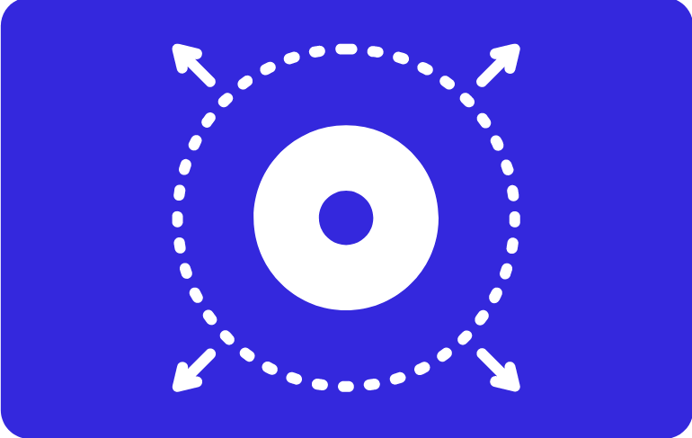
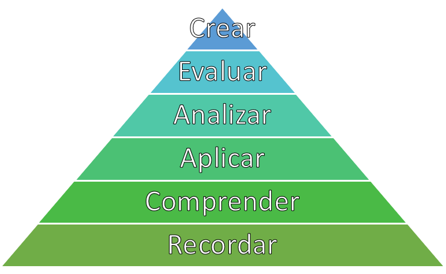

# ¿CÓMO DELIMITAMOS LO QUE EVALUAREMOS EN NUESTRO EXAMEN? {#COMP2}

{width=60%}

En este componente revisaremos todo el procedimiento necesario para delimitar el constructo que evaluaremos, desde el marco conceptual hasta la generación de nuestra tabla de especificaciones. Todo el procedimiento aquí definido se basa primordialmente en la propuesta del @INEE2019

## Definiendo nuestor marco conceptual

Una vez que ya sabemos lo que queremos medir, y tenemos un plan general de cómo queremos lograrlo, es importante que definamos el [marco conceptual](#marco-conceptual) a partir del cual vamos a generar nuestro instrumento. Al hablar de marco conceptual nos estamos refiriendo a la base teórica que da sustento a los reactivos que vamos a redactar en la siguiente sección.  En el ejemplo que ya hemos utilizado, si lo que queremos es medir la comprensión lectora de nuestros alumnos, primero tenemos que definir a qué nos referimos con comprensión lectora, o qué significa que una persona tenga comprensión lectora. En ese sentido, en lugar de tratar de generar una definición propia, es importante que, para darle mayor sustento a nuestro instrumento, comencemos a revisar las definiciones y teorías que ya existen y que otros autores han dado con respecto al constructo, lo que nos permitirá darnos cuenta que existen diversas posturas con respecto a lo que significa evaluar el nivel de comprensión lectora; dentro de estas distintas posturas, habrán algunas que nos resulten más afines a los propósitos de nuestro examen, o que simplemente abarquen el constructo de mejor manera de acuerdo con lo que planteamos inicialmente. Es por ello que es de suma importancia que hagamos una revisión extensiva de la literatura que nos permita ubicar el marco conceptual y la definición del constructo que tengan mayor concordancia con los propósitos que planteamos en la primera etapa. 

:::nota 
**Nota:** 
Es importante considerar que cuando hagamos la búsqueda para definir específicamente el constructo que queremos medir, no nos encontraremos con definiciones aisladas y puntuales, sino con marcos conceptuales extensos que den sustento a las definiciones propuestas, y que habrá varios autores y trabajos encaminados dentro de un mismo marco conceptual. Habrá constructos como el de comprensión lectora que tendrán una amplia gama de modelos teóricos de donde elegir, pero habrá otros constructos menos estudiados dentro de los que quizá tendremos que generar nuestras propias definiciones a partir de lo que ya han estudiado otros autores al respecto.
:::

:::aera
**Estándar 1.12:** 
*"Si la razón fundamental para la interpretación de los puntajes para un uso dado depende de premisas sobre los procesos psicológicos u operaciones cognitivas de los examinandos, debe proporcionarse la evidencia teórica o empírica que respalde esas premisas. Cuando enunciados sobre los procesos empleados por observadores o calificadores sean parte del argumento de validez, debe proporcionarse información similar."*

[@AERA2018]
:::

## Pasando de la definición del constructo a la construcción de reactivos

### Operacionalizando

Ahora que ya tenemos el propósito del instrumento y el constructo que va a evaluar (definido dentro de un marco conceptual), la siguiente pregunta es ¿cómo paso de la definición del constructo a generar los reactivos? La mejor manera de llevar a cabo este procedimiento es mediante la [operacionalización](#opera), una palabra muy técnica que en esencia significa traducir la definición de nuestro constructo en términos medibles y observables. En otras palabras, se trata de descomponer el constructo en aquellas dimensiones o aspectos que nos puedan dar cuenta de éste. Si seguimos con el ejemplo del examen de comprensión lectora, la pregunta quizá sería: ¿qué características tiene o qué competencias cuantificables puede demostrar una persona con buena comprensión lectora? Supongamos que nos basamos en el modelo conceptual que ofrece PISA [@PISA2018]. para responder a estas preguntas. Dentro de la definición de comprensión lectora que PISA ofrece, destacan tres componentes principales: localizar, comprender y reflexionar. En este ejemplo, estos tres componentes se convertirán en las dimensiones principales de nuestro instrumento, que a su vez se desglosarán en subcomponentes específicos. 

:::nota
**Nota:** 
Estas distintas partes del instrumento suelen tener nombres diversos según se revisen dentro de la literatura, por lo que es posible encontrarles como áreas, dominios, componentes, dimensiones, etc. 
:::

En exámenes de conocimientos, es importante que delimitemos el contenido que se va a incluir. Por lo general, tanto nuestra definición del marco conceptual como nuestro proceso de operacionalización estarán en función ya sea del plan de estudios o del programa de la materia que se pretende evaluar. En estos casos, nuestra función será definir qué contenidos de dicho plan de estudio o programa serán los que incluiremos en nuestro examen, lo cual puede depender en gran medida del propósito del examen y de sus usos e interpretaciones previstos.

Habrá ocasiones, como el ejemplo anterior, en que el marco conceptual ya incluya un proceso de operacionalización; es decir, que ya dentro de la revisión de la literatura nos encontremos con una definición que divide el constructo en distintos componentes y subcomponentes. En otras ocasiones, el constructo que queremos medir quizá ya esté definido por el plan de estudios o programa, como ya se mencionó. Por ejemplo, puede que busquemos generar un examen para evaluar los conocimientos al egreso de alumnos de preparatoria con respecto a su nivel de inglés. Dado que lo que deseamos evaluar son los conocimientos adquiridos durante su formación en este tema, la ruta más evidente será referirnos al plan de estudios de la preparatoria y revisar los contenidos específicos de las materias referentes a inglés, donde ya encontraremos desglosados los componentes y objetivos de aprendizaje que se tuvieron durante su impartición. 

:::aera 
**Estándar 1.11:** 
*"Cuando la razón fundamental para la interpretación de los puntajes de la prueba para un uso dado se basa en parte en lo apropiado del contenido de la prueba, los procedimientos seguidos en la especificación y generación del contenido de la prueba deben describirse y justificarse con referencia a la población que se prevé evaluar y al constructo que la prueba tiene por objeto medir o el dominio que tiene por objeto representar. Si la definición del contenido muestreado incorpora criterios como la importancia, frecuencia o criticidad, estos criterios también deben explicarse y justificarse con claridad."*

[@AERA2018]
:::

### Elaborando nuestra tabla de especificaciones

Ya que hemos definido en términos operacionales nuestro constructo, es importante que capturemos esa información en lo que llamaremos nuestra [tabla de especificaciones](#tabla-espec-G). Esta herramienta será nuestra guía fundamental que nos permita generar los reactivos directamente a partir de la definición que hemos generado. Comenzaremos por mostrar un ejemplo de tabla de especificaciones que nos permitirá desglosar sus componentes y comprender su estructura. Cabe hacer la aclaración, de que no existe una sola forma de generar tablas de especificaciones, y que los componentes de la misma dependerán mucho del propósito de nuestro instrumento y de las características del constructo. 

							
**Ejemplo de tabla de especificaciones:**  

Dentro de la primera columna, será importante que definamos los componentes o dimensiones principales de nuestro constructo; es decir, las áreas que se desglosan directamente de la definición del constructo. En el ejemplo de comprensión lectora, estas tres áreas tomadas de la definición de PISA [@PISA2018] serían localizar, comprender y reflexionar. 

Después, en la segunda columna añadiremos los subcomponentes en caso de que el constructo evaluado lo permita. Supongamos que queremos hacer un examen de historia de México. Los componentes serían quizá grandes fases o etapas de la historia, como la revolución mexicana, y los subcomponentes podrían ser acontecimientos importantes dentro de estas etapas históricas, como el plan de San Luis, la decena trágica o el plan de agua prieta. 

Como estamos hablando de exámenes de conocimientos o habilidades, es importante que definamos también los [aprendizajes esperados](#aprendizaje) o los aspectos a evaluar. En otras palabras, en el ejemplo del examen de historia de México, debemos definir qué del plan de San Luis esperamos que el alumno sepa específicamente. Para generar estos aprendizajes esperados, es importante que los definamos en términos de [niveles de aprendizaje](#niveles). Para ello, el ejemplo que se utilizará aquí se basa en la taxonomía de Bloom revisada por @anderson2001, pero cabe aclarar que no es la única taxonomía existente para los niveles de aprendizaje.

Una de las mayores ventajas de utilizar este tipo de taxonomías es que nos ayudan a acercarnos más en el camino de generar reactivos, ya que nos permiten aterrizar los dominios y subdominios en acciones concretas. La taxonomía de Bloom nos muestra distintos niveles de habilidades cognitivas que van de lo más sencillo a lo más complejo, y dichas habilidades son definidas en términos de verbos específicos para cada una de ellas, lo que permite llevar el conocimiento a la acción. 

**Niveles de aprendizaje de Bloom:**  

En un examen específico, dependiendo del nivel educativo, y sobre todo de los contenidos particulares del constructo que se pretende medir, podremos requerir usar todos los niveles presentados en la taxonomía o solamente algunos. Por ejemplo, en el examen de historia de México, habrá una importante cantidad de reactivos que impliquen únicamente recordar, que permitan demostrar que el alumno ubica específicamente los acontecimientos en los momentos en que ocurrieron. Sin embargo, habrá otros reactivos que impliquen no solamente recordar, sino también comprender cómo esos acontecimientos se relacionan, o qué situaciones fueron las causantes de ciertos eventos históricos. Podríamos incluir también reactivos que impliquen analizar y evaluar, pero difícilmente podremos incluir reactivos de aplicar, ya que se trata de un constructo que no tiene una forma aparente de aplicación como si lo tienen, por ejemplo, los constructos relacionados con matemáticas; en un examen de álgebra, es mucho más probable que nos encontremos con reactivos que le pidan al sustentante realizar operaciones matemáticas para resolver un problema en específico, lo cual pertenecería al nivel de aplicación dentro de la taxonomía de Bloom. 

En realidad, veremos que el mismo proceso que ya realizamos hasta aquí nos ayudará a definir qué niveles de aprendizaje son más útiles para lo que pretendemos evaluar. Con lo que llevamos hasta el momento de la tabla de especificaciones, podemos alinear los dominios y subdominios y aprendizajes esperados con la taxonomía de Bloom, de tal manera que podamos redactar los aprendizajes esperados en concordancia con el nivel de habilidad cognitiva que esperamos del sustentante para ese aspecto en específico. Para un mismo domino o incluso para un mismo subdominio, podemos tener varios aprendizajes esperados en distintos niveles de la taxonomía de Bloom. Por ejemplo, para el subdominio del plan de San Luis dentro del dominio de la revolución mexicana, podemos ubicar como aprendizajes esperados que el sustentante recuerde qué era el plan de San Luis o cuáles eran sus principales puntos. A su vez, también podemos tener como aprendizaje esperado que comprenda qué implicaciones tuvo para el desarrollo de la revolución. 

La pregunta importante que nos permitirá delimitar qué niveles de la taxonomía esperamos para cada dominio y subdominio es: ¿qué es lo más importante que se espera que el alumno sepa de este tema? Supongamos que queremos hacer un examen para el ingreso a un posgrado en investigación, y dentro de los dominios incluimos la estadística, y dentro de los subdominios incluimos medidas de tendencia central. De este tema, ¿qué nos interesa más que el alumno sepa?, ¿nos interesa que sepa el concepto de qué es la media?, ¿nos interesa que demuestre que sabe obtener la media a través de la fórmula?, o, posiblemente ¿nos interesa que el alumno sepa interpretar el significado de esta? Quizá la respuesta sea que nos interesan los tres aspectos, pero dado que dos son procedimientos secuenciados (para interpretarla debo saber qué es), podríamos quedarnos solamente con los niveles de aplicación y análisis. 

:::nota
**Nota:** 
Es muy importante que, aunque la taxonomía de Bloom ya nos ofrece ciertos verbos que podemos utilizar en cada nivel de aprendizaje, redactemos cada uno de la manera más concreta posible, evitando que queden más de un aprendizaje o verbo por aprendizaje esperado. En algunas tablas de especificación, se puede dedicar una columna específica para poner de manifiesto el nivel de la taxonomía de Bloom para cada aprendizaje esperado.
:::

Ya que hemos delimitado los dominios, subdominios y aprendizajes esperados, el siguiente paso es determinar cuántos reactivos requeriremos por cada aprendizaje esperado, y en general, por cada dominio y subdominio. Esta decisión dependerá de múltiples factores. En parte ya estará delimitada desde el plan general que realizamos en el primer componente, pero también, dependerá de la importancia de cada uno de los dominios, subdominios y aprendizajes esperados. Supongamos que, en el examen de estadística para el ingreso al posgrado, incluimos los subdominios de medidas de tendencia central, medidas de dispersión y comparación de medias (prueba t, ANOVA, etc.). Dado que el posgrado al que se va a ingresar es de cohorte experimental, es muy importante que los alumnos sepan utilizar pruebas para comparar las medias, y, dado que es un tema más amplio y complejo que los otros dos, es razonable decidir incluir más reactivos de este subdominio que de los otros. El peso que tendrá cada dominio, subdominio y aprendizaje esperado podrá estar dado por los requerimientos de la institución solicitante del examen, por el plan de estudios que se está tomando como base, por la revisión de la literatura que indica mayor peso de un dominio sobre otro, o por la consulta con expertos que nos indiquen cuáles son de mayor importancia. 

Finalmente, hay algunos otros aspectos que podemos incluir dentro de nuestra tabla de especificaciones para guiar de manera más sencilla la construcción de reactivos. Podemos incluir qué tipo de reactivo se espera para cada aprendizaje esperado, si es que utilizaremos distintos tipos de reactivos (más detalles en la siguiente sección). También es posible incluir más detalles de lo que esperamos específicamente de cada subdominio y aprendizaje esperado. Este punto será útil si recibiremos ayuda para la redacción de los reactivos. Uno de los propósitos principales de la tabla de especificaciones es dejar todo tan claro y específico que sea posible entregarla a distintos redactores de reactivos, y que ellos sean capaces de generar los reactivos correspondientes únicamente con la tabla como guía. Por ello, si hay algo más que sea de importancia para la generación de reactivos, es importante añadirlo a la tabla. Por último, podemos poner fuentes de información específicas para el diseño de cada reactivo, lo cual servirá para dar sustento teórico al instrumento, pero a la vez, servirá para que los redactores puedan consultar dichas fuentes de información para generar cada reactivo.

:::evidencia
**Evidencia documental:** 
En este componente, nuestra principal evidencia documental será la propia tabla de especificaciones que generamos. Sin embargo, también será de suma importancia que generemos un registro de las fuentes consultadas para generar el marco conceptual y el proceso de operacionalización, construyendo un texto en el que se documente todo el procedimiento de revisión teórica y la información obtenida
:::

:::seguridad
**Seguridad:** 
La tabla de especificaciones debe resguardarse y delimitar específicamente quién tiene acceso a ella. Parte de la información aquí obtenida puede hacerse pública, tanto el marco conceptual como parte del proceso de operacionalización, pero es importante resguardar todo aquello que pueda atentar contra la validez de la prueba; es decir, si se filtra información hacia los examinados de los contenidos específicos del examen, esto puede invalidar la interpretación de que su puntaje se debe a su nivel de conocimientos, dado que en este caso estaría influido por su conocimiento de la estructura y contenidos del examen.
:::

## A modo de repaso

:::quiz

[**¿Para qué necesitamos un marco conceptual del constructo a evaluar?**]

:::

:::quiz

[**¿Cuál es la utilidad que tiene generar una tabla de especificaciones?**]

:::
