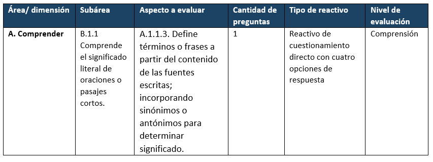

# ¿CÓMO ELABORAMOS NUESTRO EXAMEN? {#COMP3}

{width=60%}

Una vez que hemos elaborado nuestra tabla de especificaciones estamos listos para comenzar la tarea de construcción de reactivos, de manera que a partir de ellos podamos realizar interpretaciones y usar los resultados del examen de manera confiable, válida y justa. 

## Redactando nuestros reactivos {#redaccion}
Como vimos en la sección anterior, la tabla de especificaciones será la guía que nos permita construir reactivos acordes a lo que queremos medir, lo cual se logra gracias a su desglose en área, subárea, aprendizaje esperado, nivel de evaluación, cantidad y tipo de reactivos.

:::nota
**Nota:** La elaboración de reactivos debe ser realizada por profesionales expertos en el campo de conocimiento al que pertenece el examen, dado que ellos manejan los temas y logran plasmar en las opciones de respuesta elementos que suelen ser los que los alumnos confunden regularmente con la respuesta correcta, por lo que estos expertos no debieron ser partícipes en la elaboración de la tabla de especificaciones.
Es necesario brindarles como insumo la tabla de especificaciones y capacitarlos en los lineamientos técnicos que deben seguir para la construcción de los reactivos. 
Antes de ir directo con la construcción, debemos conocer qué es un reactivo, los elementos que lo conforman y los tipos de reactivos de opción múltiple que podemos utilizar.
:::

Un reactivo es un planteamiento que solicita la realización de una tarea, está conformado por la base donde se especifica el planteamiento preciso del problema a resolver, también tiene opciones de respuesta donde una es la respuesta correcta y los otros son opciones incorrectas o distractores. 

Los diferentes tipos de reactivos de opción múltiple tienen ventajas y desventajas, pero la elección de uno u otro depende principalmente de su adecuación al aprendizaje esperado y al nivel de evaluación que nos señale la tabla de especificaciones. Según Rodríguez y Albano (2017) y Ceneval (2013) los reactivos se pueden clasificar en: 

### Reactivos de cuestionamiento directo: 
Su base se construye en forma de pregunta la cual solicita una respuesta directa que se encuentra entre las opciones de respuesta, también pueden ser formuladas de manera que sea una oración que deba ser completada en su estructura final, es decir, que las opciones de respuesta cierren la oración que está en la base del reactivo.

### Reactivos de completamiento: 
Su base es un enunciado donde se establece la información relevante omitiendo uno o dos conceptos o palabras importantes. Las opciones de respuesta están conformadas por los conceptos o palabras más plausibles que deben completar el enunciado, pero solo una opción debe ser la correcta. A diferencia de los reactivos de cuestionamiento directo, el concepto o palabra faltante no puede ir al final o al principio de la oración, y como máximo estos reactivos deben tener tres espacios para completar.  

### Reactivos de elección de elementos o complejos: 
Solicitan al alumno elegir dos o más elementos según un criterio establecido en el enunciado o pregunta base del reactivo. En las opciones de respuesta se ponen combinaciones de los elementos y el alumno debe seleccionar la opción que tenga la combinación de elementos que sea la correcta. 

### Reactivos de jerarquización u ordenamiento: 
El enunciado base del reactivo establece un criterio con el cual solicita al alumno ordenar un conjunto de elementos, por lo que las opciones de respuesta muestran el conjunto de elementos en distinto orden y el alumno debe seleccionar la opción que los ordena de manera correcta según el criterio señalado. 

### Reactivo verdadero o falso: 
La base del reactivo muestra una oración o enunciado declarativo, por lo que se requiere que el alumno señale si el enunciado es verdadero o falso. 

### Reactivos de relación de columnas o matching: 
La base del reactivo está constituida por dos conjuntos de elementos que deben ser relacionados de acuerdo con un criterio especificado. Las opciones de respuesta mostrarán diferentes relaciones entre los elementos y los alumnos deberán elegir la que contenga la combinación correcta. 

### Conjuntos de reactivos basados en contexto o multireactivos: 
Esta clasificación hace referencia a la agrupación de reactivos que buscan responder a un mismo estímulo, por ejemplo, hacer uso de un cuento y en función de él desarrollar el contenido de reactivos que midan comprensión lectora, por lo que los diferentes reactivos que parten de un mismo estímulo pueden estar basados en cualquiera de las clasificaciones anteriormente explicadas, es decir, pueden tener diferentes formatos. 

:::nota
**Nota:**
Usar el formato “conjunto de reactivos basados en contexto” requiere la utilización de un [escenario o estímulo](#estimulo), por lo que son reactivos valiosos por su utilidad para evaluar niveles cognitivos superiores como aplicación, análisis y evaluación. Su construcción requiere que se seleccione o construya un texto o escenario que sea adecuado y significativo para los alumnos de acuerdo con su nivel educativo y contexto. Según la OECD (2018) estos recursos pueden abordar situaciones personales, públicas, educativas u ocupacionales y los textos que elijamos pueden ser de tipo descriptivo, narrativo, explicativo o argumentativo, los cuales pueden tener diferentes formatos de diseño y transición dependiendo del contenido y del medio por el cual se va a aplicar el examen.
:::

Una vez que ya identificamos los tipos de reactivos o formatos que se pueden desarrollar y ya seleccionamos a los expertos que nos apoyarán en su construcción, es viable empezar con la capacitación de los expertos guiándonos de la tabla de especificaciones, por ejemplo, en un examen de comprensión lectora es esencial la utilización de estímulos como textos o escenarios.

Imaginemos que ya se ha seleccionado el texto del cual se basará el contenido de los reactivos y que se tiene la siguiente información en la tabla de especificaciones:

 

En este ejemplo tenemos que desarrollar un reactivo de cuestionamiento directo con cuatro opciones de respuesta que nos permita evaluar la habilidad que el alumno tiene para definir términos o frases a partir del contenido de fuentes escritas incorporando sinónimos o antónimos para determinar significado. El reactivo debe requerir un nivel cognitivo de comprensión, por lo que el reactivo, basándose en la información del texto o estímulo seleccionado, podría quedar de la siguiente manera:

:::reactivo

*Parafraseando al Dr. Gary Small, autor de “El cerebro digital”, «la actual eclosión de la tecnología digital no solo está cambiando nuestra forma de vivir y comunicarnos, sino que está alterando, rápida y profundamente nuestro cerebro»;*

En el contexto de la lectura, ¿a qué hace referencia el término “eclosión” utilizado por el Dr. Gary Small?

A) Acción de “salir del cascarón” o “salir de lo cerrado”.
B) Explosión de un fenómeno o un movimiento social o cultural.
               C) Irrupción abrupta o el crecimiento súbito de algo.
               
:::

:::nota
**Nota:**
Los reactivos de ejemplo de esta sección se basan en un texto argumentativo que se puede encontrar en el siguiente enlace:  [Setién, M. (2017). Redes sociales y adolescencia: ¿oportunidad o peligro?](https://www.abc.es/familia/educacion/abci-redes-sociales-y-adolescencia-oportunidad-o-peligro-201605230137_noticia.html?ref=https:%2F%2Fwww.google.com%2F)
Para fines prácticos, solamente incluimos pequeñas viñetas de este texto para contextualizar los reactivos de ejemplo.
:::

Es esencial que al construir los reactivos los expertos justifiquen las opciones de respuesta, tanto la correcta como los distractores, lo cual brindará la oportunidad de rectificar si las opciones son adecuadas o si hay una opción que sea parcialmente correcta. 

Ahora bien, recordemos que lo que buscamos en la elaboración de nuestro examen es que este sea [estandarizado](#estandar) y que los reactivos tengan parámetros psicométricos adecuados para su implementación; es debido a esto que se han establecido ciertos lineamientos técnicos que se deben seguir para conseguir su adecuada construcción. Si bien estos lineamientos varían de acuerdo a los requerimientos de cada institución y de acuerdo al formato de los reactivos, hay algunos que son generales para los exámenes de opción múltiple según @rodríguez2017, los cuales son:

*	**Basar cada reactivo en un aspecto del contenido o una tarea cognitiva.**

Imagina que se plantea un reactivo de la siguiente manera: 

:::reactivo

*Los primeros automóviles fueron recibidos con vítores, sin embargo, a medida que fue popularizándose su uso y empezaron a aparecer los problemas, aumentaron las voces en su contra.* 
        ¿Qué argumento intenta justificar el autor con la analogía de los primeros automóviles y por qué?
         
:::

En este ejemplo se está solicitando en una misma pregunta dos tareas cognitivas, primero la identificación del argumento que intenta justificar García Fernández y luego la explicación del porqué de esa justificación. Lo que nos señala este lineamiento es que se debe construir el reactivo los más claro y directo posible de manera que el alumno comprenda la única tarea cognitiva que debe realizar.

*	**Utilizar material y contexto nuevos para obtener habilidades cognitivas de orden superior.**

Como se mencionó anteriormente, cuando se utilizan escenarios o textos se pueden construir reactivos que no solo busquen evaluar procesos cognitivos como recordar o comprender, sino que soliciten al alumno analizar, aplicar y evaluar. Por ejemplo, si en una clase de estadística, se les enseñó a los alumnos a obtener la media, mediante un ejercicio con algunos datos, dentro del examen, se les puede solicitar obtener la media de una base de datos más grande y con datos diferentes.

*	**Mantener el contenido de los reactivos independientes entre sí.**

Se debe evitar que la respuesta de un alumno a un reactivo influya en su respuesta a otro, es decir, debemos buscar que cada reactivo nos brinde información sobre los conocimientos, habilidades y aptitudes de los alumnos de manera independiente, de lo contrario si el alumno contesta mal uno de los reactivos por ende el otro también será incorrecto.

*	**Probar el contenido importante. Evitar el contenido demasiado específico y general.**

Imagina que se plantea la base del reactivo de la siguiente manera:

:::reactivo

¿En qué año se publicó el artículo donde el autor hace la analogía de los primeros automóviles?

:::

Este reactivo está solicitando información muy específica, en este caso busca evaluar la identificación de un elemento del artículo, por lo que hay que preguntarse si el reactivo ofrece información relevante sobre los conocimientos, habilidades y aptitudes de los alumnos o si se puede transformar un reactivo que mida elementos clave del aprendizaje. La misma lógica aplicaría si se elaboran reactivos que solicitan información muy general.

*	**Evitar opiniones y trucos.**
Imagina que se plantea la base del reactivo de la siguiente manera:

:::reactivo

¿Cuál consideras que es el propósito principal del autor del artículo con respecto al uso de redes sociales?

:::

Se debe evitar redactar el reactivo de manera que se preste a solicitar una opinión por parte del alumno, lo cual causaría que no haya solo una respuesta correcta pues esta depende de lo que crea u opine el alumno. En este caso lo mejor sería preguntar de manera directa _“¿cuál es el propósito...?”_

*	**Organizar cada reactivo verticalmente en lugar de horizontalmente.**

Con respecto al formato de los reactivos y sus opciones de respuesta, lo ideal es que estén organizados de manera vertical, lo cual facilita la lectura de las opciones de respuesta y evita que los alumnos se confundan en la posición de la opción que van a seleccionar, debido a que de manera horizontal las opciones pueden estar demasiado juntas. 

*	**Editar y probar los reactivos**

Este lineamiento es importante sobre todo en exámenes donde se usan formulas o notaciones que, si están mal colocadas, pueden ocasionar que los alumnos respondan de manera incorrecta, aunque si tengan la habilidad que se requiere. Lo ideal es que los reactivos sean revisados por un asistente o corrector que verifique la correcta colocación de las notaciones y fórmulas.

*	**Mantener la complejidad del lenguaje de los reactivos en un nivel apropiado para la clase que se está probando**

Imagina que se plantea el reactivo de la siguiente manera:

:::reactivo

Según el autor del texto los adolescentes que suelen descollar en el uso de las redes sociales presentan más problemas de 

:::

Este reactivo ejemplifica el cuidado que se debe tener en el uso de palabras que no vayan acorde al nivel educativo de los alumnos a los que va dirigida la prueba. En este caso puede ser que la palabra “descollar” no sea comprendida por todos los alumnos, por lo que sería adecuado cambiarla por una palabra más sencilla como “exceder”, de lo contrario no solo se está midiendo la comprensión lectora de los alumnos sino también el conocimiento de vocabulario, es decir, se está agregando otro constructo que va a intervenir en la respuesta. 

Los alumnos que no comprendan la palabra van a dar una respuesta incorrecta que no se debe a su poca habilidad de comprensión lectora sino a que no conocen el vocabulario, lo cual finalmente afecta las interpretaciones que podamos hacer de los resultados de la prueba. 

*	**Minimizar la cantidad de lectura en cada reactivo. Evitar los adornos.**

Se debe evitar presentar escenarios, textos o enunciados de los reactivos demasiado cargados de información, debido a que se sobrecarga cognitivamente al alumno y por ende lo que conteste no tendrá que ver son su habilidad de comprensión lectora, sino con el cansancio. También el uso de adornos, en vez de apoyar la información del reactivo, lo hace más complejo de manera innecesaria, a menos que nuestro examen tenga como objetivo evaluar un curso de lectura. 

Otro aspecto que permite construir un reactivo que se lea de forma fluida y precisa, es mover a la base o enunciado las palabras que se repiten en cada opción de respuesta. Por ejemplo: 

:::reactivo

En el contexto del artículo, cuando García menciona el concepto defenestrar se refiere 
A) a atacar
B) a alabar 
C) a justificar 

:::

En este caso para hacer más fluido el reactivo se puede mover el artículo “a”, que se encuentra en cada opción de respuesta, a la base del reactivo y así solo dejamos los verbos en las opciones. 

*	**Enunciar la idea principal en la base de forma clara y concisa y no en las opciones.**

Se tiene que tener siempre presente que un buen reactivo es aquel que desde que lees el enunciado puedes pensar en la respuesta correcta, sin ver las opciones de respuesta. Por lo que se debe procurar que la idea principal se encuentre en la base y no en las opciones.

*	**Redactar la base positivamente; evite las frases negativas.**

El problema en el uso de frases negativas es que los alumnos tienden a pasar por alto el sentido negativo de una oración y que muchas veces estos enunciados pueden caer en la doble negación, lo cual ocasionaría que los alumnos entiendan de manera incorrecta el enunciado; por lo que se recomienda evitar su uso cuando se elabore un reactivo, pero en caso de que se tengan que utilizar, lo adecuado es poner la palabra “No” en negritas y subrayada. 

*	**Escribir tantas opciones como sean necesarias, dado el tema y la tarea cognitiva; tres opciones suelen ser suficientes.**

Es importante que se comprenda el papel de los distractores, son una parte vital en el buen funcionamiento de los reactivos, por lo que su elección suele estar basada en las principales confusiones o errores típicos que tienen los alumnos en el tema que se aborda, por ejemplo, si el reactivo pregunta algún aspecto sobre la revolución mexicana y el docente ha observado que sus alumnos suelen confundir los contenidos del Plan de San Luis con los del Plan de Agua Prieta, puede usarla como opción distractora.  

La elección de la cantidad de opciones de respuesta también es importante, se ha encontrado que tres opciones son suficientes, pero si los reactivos requieren un equilibrio entre las opciones también pueden ser cuatro, es decir, el número de opciones depende principalmente de la naturaleza del reactivo y de que los expertos logren identificar los distractores más plausibles o atractivos que permitan identificar a los alumnos que saben y los que no. Una vez que hemos determinado la cantidad de opciones de respuesta que usaremos, es importante ser consistentes dentro del examen, y que todos los reactivos tengan el mismo número de opciones de respuesta.

*	**Asegurarse de que solo una opción sea la respuesta correcta.**

A menos que el formato del reactivo sea de elección de dos o más elementos, es necesario asegurarse de que el reactivo solo tenga una respuesta correcta, por lo que escribir la justificación, tanto de la opción correcta como de los distractores, es útil para percatarse cuando se debe cambiar un distractor debido a que puede ser parcialmente correcto.

*	**Colocar las opciones en orden lógico o numérico.**

Ordenar las opciones de respuesta siguiendo una secuencia lógica, evita que los alumnos traten de encontrar un patrón de respuesta que se deba a la ubicación de la respuesta correcta en todos los reactivos y en su lugar fomenta que los alumnos se enfoquen en el contendido. Además, hace más fluida la lectura, por lo que reduce la carga cognitiva. 

*	**Variar la ubicación de la respuesta correcta de manera uniforme entre las opciones.**

Se debe evitar que la opción correcta se ubique en el mismo lugar en la mayoría de los reactivos, todas las opciones de respuesta deben tener la misma probabilidad de tener la respuesta correcta a lo largo de todo el examen. 

*	**Mantener las opciones independientes; las opciones no deben superponerse.**

Si dos opciones de respuesta se superponen, ambas opciones sean correctas, por lo que deben ser independientes una a de otra.

*	**Evitar usar las opciones “ninguna de las anteriores”, “todas las anteriores “y “no lo sé”.**

Imagina que se platea el reactivo de la siguiente manera:

:::reactivo

Las recomendaciones que hace Bilbao van dirigidas a que los adolescentes

A.	generen mayor autocontrol y tengan más espacios distintos al entorno virtual.

B.	se desintoxiquen de las redes sociales para que convivan con sus familias.

C.	ejerzan mayor autocontrol en distintos espacios y momentos del día.

D.	todas las anteriores 

:::

Si se incluye la opción “todas las anteriores” se está dando pistas sobre la respuesta correcta al alumno, es decir, si el alumno descarta la opción B entonces sabe que la D tampoco es la correcta; otra opción es que si el alumno se da cuenta de que la A y C son correctas puede escoger la opción D, lo cual evita que el reactivo sea discriminativo, pues no ayuda a diferenciar cuales son los alumnos que tienen un adecuado nivel de comprensión lectora, debido a que los alumnos con un conocimiento parcial pueden responder el reactivo correctamente. Por lo que hay que evitar hacer uso de este tipo de opciones de respuesta.

*	**Expresar las opciones de manera positiva; evitar palabras negativas como "no".**

Como en el caso del enunciando o la base del reactivo, se debe evitar que las opciones de respuesta estén redactadas de manera negativa, dado que pueden confundir a los alumnos.

*	**Evitar dar pistas sobre la respuesta correcta.**

Algunas de las recomendaciones que se deben de seguir son:

  +	Las opciones de respuesta deben tener una longitud similar dado que se ha comprobado que la respuesta más larga tiende a ser la correcta
  
  +	Evitar incluir palabras como “siempre” “nunca” “completamente” porque los alumnos tienden a descartarlas rápidamente debido a que son absolutos que raramente se cumplen 
  +	Evitar que los alumnos hagan asociaciones entre la base del reactivo y la repuesta correcta debido a que contienen la misma palabra
  
  +	Evitar hacer uso de opciones ridículas o absurdas que los alumnos descarten de inmediato
  
  +	Mantener las opciones similares en su contenido semántico y en su estructura 

:::nota
**Nota:**
Para más ejemplos de cada uno de estos lineamientos generales, consultar el capítulo 4 “ Writing Multiple-Choise Items” de @rodríguez2017 referido en la bibliografía de este manual.
:::

Como podemos ver, la redacción de un reactivo no es tarea sencilla, hay muchos aspectos que se deben cuidar para que no intervengan y afecten el constructo que queremos medir, de otra manera las interpretaciones que hagamos de los resultados y usos de la prueba no serán válidos y podrían traer consecuencias negativas para los sustentantes, por lo que, una vez capacitados los expertos a partir de los lineamientos y que se hayan redactado los reactivos, estos deben pasar por una revisión profunda antes de ser aplicados. 

## Validando nuestros reactivos

Una vez redactados los reactivos, es necesario que sean revisados para constatar que estén alineados de manera adecuada con la tabla de especificaciones y que no tengan sesgos que puedan poner en riesgo su validez, por ejemplo, que no contengan palabras o términos ofensivos o que pongan en desventaja a una subpoblación por sus características personales como género, religión, idioma, etc. Este es un aspecto fundamental que la @AERA2018 llama imparcialidad, aspecto que de no cuidarse puede ocasionar [varianza irrelevante al constructo](#varianza), es decir, que intervengan variables que no nos permitan evaluar de manera precisa el constructo que queremos medir.

:::nota

Nota. Las revisiones deben llevarlas a cabo diferentes grupos de expertos, los cuales no participaron en la construcción de los reactivos, todo esto con el fin de que la revisión sea lo más objetiva posible. Debe haber expertos para:

1.	Verificar que los reactivos estén alineados a la tabla de especificaciones
2.	Revisar que se cumplan los lineamientos técnicos
3.	Hacer una revisión de estilo o editorial 
4.	Verificar que los reactivos no estén sesgados hacia algún subgrupo de la población objetivo 

Es necesario que las revisiones de los reactivos no las realicen los mismos grupos de expertos.

:::

Primero debe hacerse una revisión técnica de los reactivos para asegurar que estos cumplen con los lineamientos técnicos correspondientes, también debe haber una revisión de estilo o editorial donde se revisen en términos de su redacción y ortografía.

Otro grupo de expertos debe validar los reactivos en función de su alineación con la tabla de especificaciones, que no presenten más de una respuesta correcta y que no intervengan otras variables ajenas al constructo que se quiera medir, todo esto con la finalidad de asegurarnos que el examen realmente mide lo que queremos medir de manera justa con los sustentantes y que no los ponga en desventaja por sus características personales como sexo, religión, etnia, raza, o nivel socioeconómico, por ejemplo, si un reactivo hace uso de una palabra con la que están más familiarizados los alumnos de un nivel socioeconómico alto, se pone en desventaja a los alumnos de nivel bajo, lo cual no les permite responder como lo hubieran hecho si se usara una palabra que es entendible para todos. Otro ejemplo para entender la importancia de las revisiones es que si un reactivo usa un término que es ofensivo para un subgrupo, afectará directamente en la respuesta de los alumnos, por lo que impide medir de manera justa el constructo de interés. 

De acuerdo con las revisiones se realizan modificaciones y/o ajustes a los reactivos. 

:::evidencia
**Evidencia documental:**
Reactivos validados por los expertos y bitácoras que señalen el proceso de validación de los reactivos por parte de cada grupo de expertos y las modificaciones a los reactivos.
:::

## Piloteando y analizando psicométricamente nuestros reactivos

Una vez que se hicieron correcciones a los reactivos de la prueba, lo ideal es que se realice una aplicación inicial a una muestra representativa de la población objetivo, con el fin de estimar sus parámetros y conocer si se comportan de manera adecuada, es decir, si son útiles para medir el constructo y cumplir con el propósito de la evaluación; además este paso nos ayuda a poner en práctica el procedimiento de administración del examen, lo cual nos permitirá mejorar la práctica de administración cuando llevemos a cabo la aplicación final del examen; recordemos que el proceso de aplicación es vital para la confiabilidad de la medición, por lo que debemos asegurarnos de llevar a cabo una aplicación con procedimientos estandarizados que permitan evitar la intrusión de [errores de medición](#error) en nuestra evaluación. Para ver de manera detallada el procedimiento de aplicación de un examen ir a al (Componente \@ref(COMP4))  del presente manual.  

El piloteo nos permitirá determinar con cuáles reactivos ensamblaremos en el examen para su aplicación final, por lo que de ninguna manera los resultados obtenidos en este paso deben ser usados para asignar puntajes finales a los alumnos.
En caso de que no se pueda realizar el pilotero con una muestra representativa de alumnos, podemos hacer uso de técnicas cualitativas que retroalimentarán el funcionamiento de los reactivos, como [entrevistas cognitivas](#entrevista), [paneles de expertos](#panel) o grupos focales, las cuales son técnicas que nos permiten obtener información de los alumnos o expertos con la que podemos modificar y mejorar los reactivos, pero no nos permiten obtener sus parámetros ni analizar de manera estadística el funcionamiento del examen como un todo.  Si el lector quiere profundizar en las técnicas cualitativas se recomienda consultar el artículo de @urrutia2014 referido en la bibliografía del presente manual. 

:::nota
**Nota:** 
Si bien este es un paso importante debido  a que nos permite determinar los errores que podemos cometer en la administración del examen y obtener los parámetros psicométricos de los reactivos, en la práctica real muchas veces es complicado el piloteo de los reactivos en una muestra representativa de la población objetivo debido al tiempo y recursos que se necesitan, por lo que en este  manual partimos de la idea de que se pueden aplicar los reactivos de manera directa a la población objetivo una vez elaborados y validados por los expertos, saltándonos el paso del pilotaje y los análisis psicométricos en esta etapa del desarrollo de nuestro examen. Por lo que en lugar de pilotearlos podemos realizar la aplicación final del examen y una vez que los alumnos lo hayan resuelto podemos llevar a cabo los análisis estadísticos de los reactivos para determinar cuáles son los que nos servirán para calificar a los alumnos y cuáles no, así con los reactivos que hayan obtenido adecuados parámetros psicométricos de acuerdo con nuestro modelo de medición, podemos obtener la calificación final de los alumnos e interpretar los resultados. Pero es necesario aclarar que, si se tiene el tiempo y los recursos, lo adecuado sería realizar una aplicación piloto y obtener los parámetros de los reactivos antes de su aplicación final.
:::

En el caso de no llevar a cabo el piloteo y por ende la primera estimación de los parámetros de los reactivos, podemos seguir leyendo el manual en el orden que venimos siguiendo, pero en caso de que si podamos realizar el piloteo de los reactivos debemos pasar al Componente [5 “¿Qué análisis podemos hacer de los resultados?”](#COMP5), el cual nos explicará de manera detallada como realizar los análisis estadísticos de los reactivos y del instrumento como un todo. Al terminar de leer dicha sección debemos regresar a este apartado para seguir leyendo de manera continua.

:::evidencia
**Evidencia documental:**
En caso de realizar el piloteo se debe obtener como evidencia un documento que señale el proceso de selección de la muestra, la estrategia que se utilizó, cuántas versiones del examen se aplicaron y con cuantos reactivos; de igual manera se debe especificar si se utilizaron métodos cualitativos. Además, se debe obtener evidencia de los resultados obtenidos en el piloteo, desde la administración el instrumento, hasta los parámetros, especificando cuales reactivos funcionan de manera adecuada y cuáles no. 
:::

## Creando nuestro banco de reactivos

La obtención de los parámetros psicométricos de los reactivos, por medio de la teoría de respuesta al ítem, ya sea mediante el piloteo o en la aplicación final del examen, es muy útil para los evaluadores dado que facilita la construcción de un banco de ítems que requiere el uso de una plataforma o programa especial que permita almacenar los reactivos que ya están [calibrados](#calibracion) y agregar la respectiva información de cada reactivo como su contenido, identificador y sus características psicométricas. De esta manera se introduce flexibilidad a la evaluación debido a que, si se requieren evaluaciones frecuentes o varias versiones de una prueba, nos facilita la selección de los reactivos que ya tienen parámetros estadísticos adecuados, es decir, el ensamblaje del examen, y aparte funciona como guía, debido a que nos permitirá realizar un diagnóstico de necesidades identificando cuando necesitemos elaborar más reactivos sobre un aprendizaje esperado debido a que los que conforman el banco han ido modificando sus parámetros estadísticos, de manera no adecuada, en diferentes aplicaciones. 

## Ensamblando nuestro examen

Como el propósito del presente manual es guiar a las comisiones en la construcción de exámenes de alto impacto, los reactivos que deberemos seleccionar para el ensamblaje son lo que nos proporcionen información adecuada sobre los examinados a lo largo de toda la escala de habilidad, es decir, debemos conformar el examen con reactivos con niveles de dificultad fácil, media y difícil de manera equilibrada, pero, es importante precisar que si el  propósito de nuestro examen está enfocado en la identificación de los estudiantes con alto desempeño, ya sea para darles una beca o para determinar ciertos lugares en una clase de alto nivel, vamos a requerir mayor cantidad de reactivos con un nivel de dificultad alto, es decir, la elección de los reactivos a incluir en el examen depende principalmente del propósito de la evaluación. 

Ahora bien, en el caso de que no se haya llevado a cabo el pilotaje de los reactivos con una muestra representativa de la población, el ensamblaje del examen deberá basarse en la conformación que determina la tabla de especificaciones.

Por su parte, si realizamos el piloteo y obtuvimos los parámetros estadísticos de los reactivos debemos basarnos tanto en la tabla de especificaciones como en los parámetros obtenidos para decidir cuáles reactivos serán parte del examen y en qué orden se presentarán, es decir, a partir del modelo de medición que especificamos desde el primer componente de este manual, debemos decidir qué reactivos cumplen los parámetros y cuáles no,  esto es importante porque en el caso de que queramos ensamblar dos formas equivalentes del examen para obtener una versión A y B, debemos asegurarnos que ambas versiones contengan lo que se conocen como [reactivos ancla](#ancla), es decir, que entre el 30 y 50% de los reactivos sean los mismos en ambas versiones y que estén ubicados en el mismo lugar en ambos exámenes, lo cual permitirá [equipararlos](#equiparacion) al momento de obtener la calificación final de los alumnos, mientras que el resto de los reactivos de las versiones deben tener parámetros estadísticos similares, es decir, si en una versión la primera pregunta tiene una dificultad baja con cierta media y desviación estándar, en la otra versión del examen el primer reactivo deberá ser equivalente en función de sus parámetros. 

Todo este proceso de ensamblaje requiere la elaboración de una tabla donde especifiquemos cómo fue el ensamblaje de la prueba o de las versiones de la prueba, en términos de cada uno de los reactivos que lo conforman, su pertenencia a la tabla de especificaciones, versión del examen en el que aparece y cuáles son sus parámetros estadísticos.

:::evidencia
**Evidencia documental:**
Presentar un documento que especifique los criterios cuantitativos y cualitativos que se eligieron para integrar el examen o las diferentes versiones de este; también se debe presentar como evidencia la tabla donde especificamos los aspectos técnicos del ensamblaje del examen.
:::

:::seguridad
**Seguridad:**
En todo este componente llamado “elaboración del examen” debemos tener mucho cuidado con la seguridad de los productos resultantes en cada paso. En el caso de la redacción de los reactivos tenemos que procurar tenerlos bajo resguardo en todo momento. Con respecto a su validación, debemos asegurarnos de que el acceso a ellos se limite únicamente a los expertos que nos apoyarán en su revisión y que inmediatamente después volverán a ser resguardados. Finalmente, los exámenes ensamblados deben ser protegidos para evitar su acceso, de lo contrario todo el proceso de medición que se está llevando a cabo se vería afectado, lo cual haría inválida y poco confiable la evaluación.
:::

:::aera
**Estándar 3.2:**
Los desarrolladores de la prueba son responsables de desarrollar pruebas que midan el constructo previsto y de minimizar el potencial de que las pruebas se vean afectadas por características irrelevantes del constructo, como características lingüísticas, comunicativas, cognitivas, culturales, físicas y otras 

[@AERA2018, p.71]
:::

:::aera
**Estándar 4.7**
Los procedimientos utilizados para desarrollar, revisar y probar ítems y para seleccionar ítems del conjunto de ítems deben documentarse (p.99).
:::

:::aera
**Estándar 4.9**
Cuando se realizan ensayos de ítems o formularios de prueba, deben documentarse los procedimientos utilizados para seleccionar la(s) muestra(s) de examinandos, así como las características resultantes de la(s) muestra(s). Las muestras deben ser tan representativas como sea posible de las poblaciones para las que está prevista la prueba (p.100).
:::

## Para ejercitar

:::quiz

[**¿Cuál es la importancia de utilizar diferentes grupos de expertos en la revisión de los reactivos?**]

:::

:::quiz

[**¿Por qué es ideal realizar un piloteo de los reactivos?**]

:::
